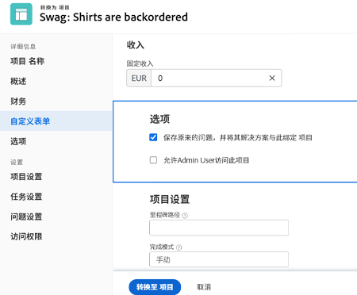
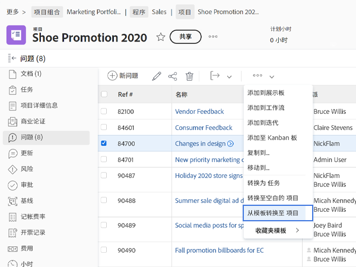

# 将问题/请求转化为项目

在本视频中，您将学习如何：

* 查看随请求提交的信息
* 选择相应的项目模板
* 完成从请求到项目的转化

>[!VIDEO](https://video.tv.adobe.com/v/340343/?quality=12&learn=on)

## 关于 [!UICONTROL Options] 部分，您需要了解的内容

如果系统管理员希望您使用他们设置的默认值，则 [!UICONTROL Options] 部分可能会被隐藏。如果出现 [!UICONTROL Options] 部分，则选项的含义如下：

**保存原来的问题，并将其解决方案与项目绑定**

如果选择此选项，则项目完成时最初的问题会被标记为已解决。如果&#x200B;**未**&#x200B;选择该选项，则原始问题会在项目创建时删除。

**允许（用户名）访问此项目**

如果选择此选项，则在创建新项目后，提出请求的人（或代表他人提出请求的人）将自动获得对新项目的访问权限。如果此选项&#x200B;**未**&#x200B;选中，则他们不会自动获得任何权限。

## 在转化过程中维护信息

传输自定义表单数据需要：

* 同一自定义表单的多份副本——一份用于问题，一份用于任务或项目。这些自定义表单上的字段应该完全匹配，以便信息可以从一个自定义表单传输到另一个自定义表单。

* 您可以使用单个自定义表单，在其中全部选择问题、任务和/或项目对象。使用此方法，您只需在单个自定义表单中创建和维护自定义字段即可。这比拥有同一表格的多个副本要容易得多，但任何一种方法都行得通。

如果您在项目模板中加入了自定义表单，则在转化过程中选择模板时会自动分配该表单。

## 将任何问题列表中的问题转换为任务或项目

为了提高工作效率并更轻松地在快节奏的环境中转化问题，您可以将项目、报告或仪表板中的任何问题列表中的问题转化为任务或项目。只需选择一个问题，然后单击出现的三点菜单即可。

## 有关此主题的推荐教程

* [将问题/请求转化为任务](/help/manage-work/issues-requests/convert-issues-to-other-work-items.md)
* [处理规划外的工作](/help/manage-work/issues-requests/handle-unplanned-work.md)

