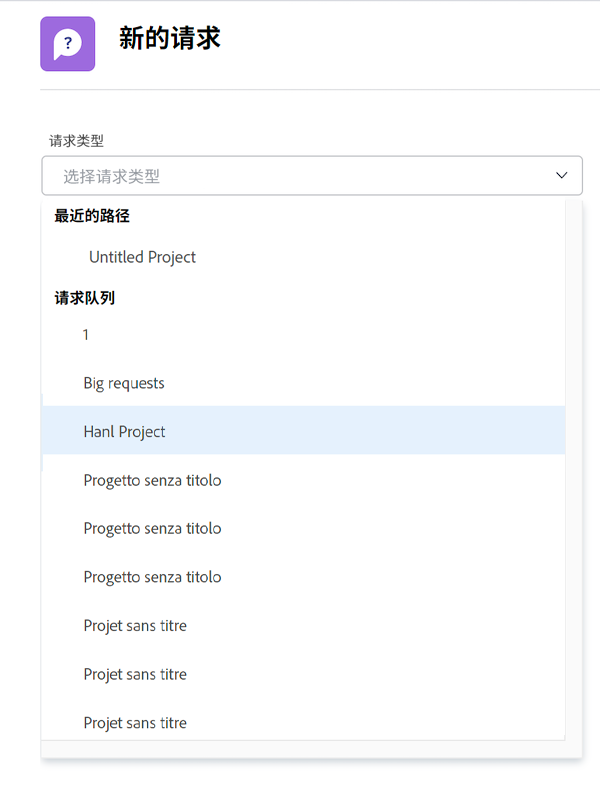
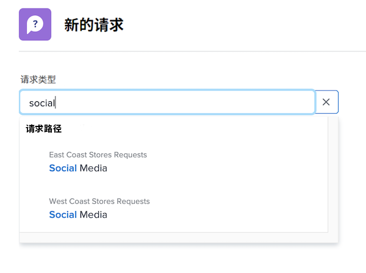
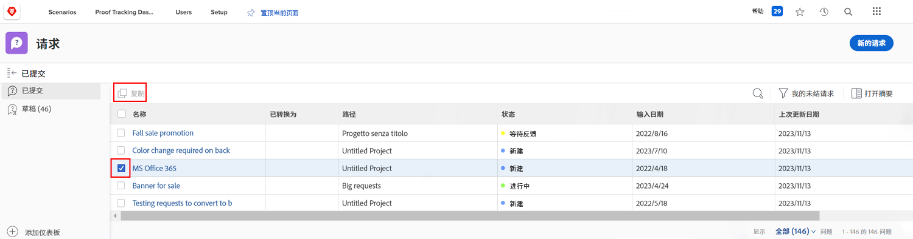
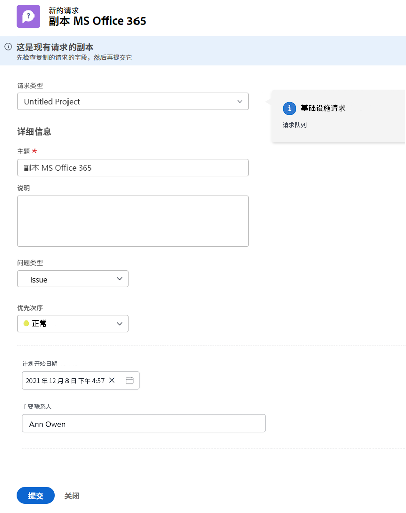

# 请求

在许多组织中，启动新项目、开发新产品或创建交付内容的第一步是在 [!DNL Workfront]. 您可以跟踪请求的进度，并在需要时提供其他信息。

在此视频中，您将学习如何：

* 导航到请求区域
* 请求
* 查看提交的请求
* 查找请求草稿

>[!VIDEO](https://video.tv.adobe.com/v/336092/?quality=12&learn=on)

## 快速轻松地访问请求队列路径

当您单击 [!UICONTROL Request Type] 字段中，您最近提交以自动显示在列表顶部的最近三个请求路径。 选择一个选项，以向该同一队列提交另一个请求。

列表底部显示您有权访问的所有请求队列。 如果您不确定要将哪个队列用于请求，请使用关键字搜索快速轻松地找到所需队列。

在键入关键词时， [!DNL Workfront] 可显示匹配项，以便您能够找到适合自己需求的请求队列路径。 例如，要请求发布社交媒体帖子，请在 [!UICONTROL Request Type] 字段和列表会动态更新以显示任何匹配项。

选择所需的选项，填写请求表单并提交请求。

## 复制已提交的请求以发出新请求

如果频繁提交同一类型的请求，则需要花费大量时间来创建每个新请求并一遍又一遍地填写相同的信息。 通过复制现有请求、仅更改需要更新的信息并将其作为新请求提交来加快该过程。

1. 单击主菜单中的请求。
1. 检查左侧面板菜单，确保您位于“已提交”部分。
1. 查找并选择要复制的请求。 一次只能复制一个请求。
1. 单击请求列表左上角的复制并提交为新图标。
1. 此时将打开“新请求”窗口，其中突出显示了“主题”字段，以便您可以命名新请求。
1. 根据需要更新请求中的其他信息。
1. 单击提交以完成。
1. 复制的请求将作为新请求提交，并显示在“已提交”列表中。

您可以复制之前提交的请求，但不能复制请求的草稿。 只要您拥有请求的“查看”权限，就可以复制其他人提交的请求。

<!---
Learn more
Requests area overview
Create and submit Workfront requests
Guides
Make a work request
--->
