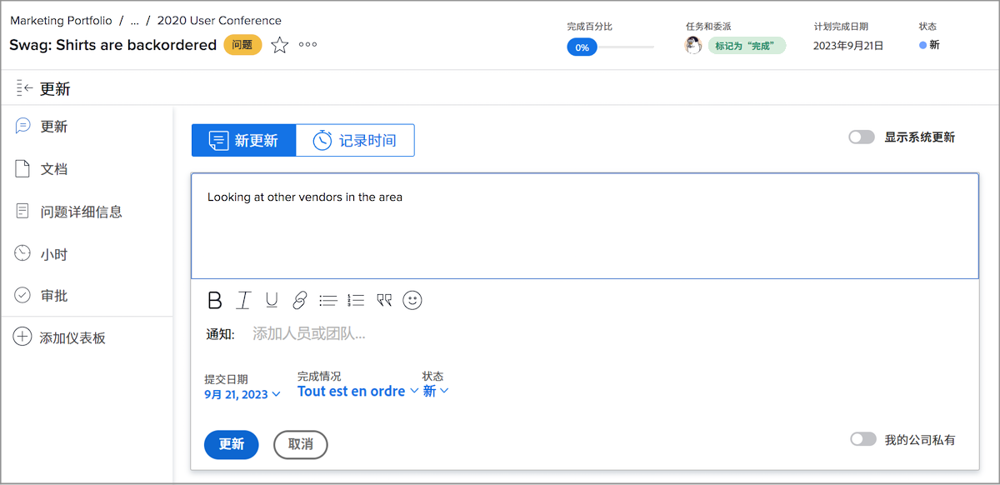
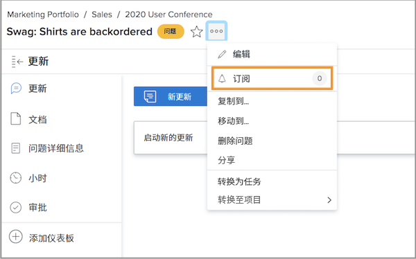
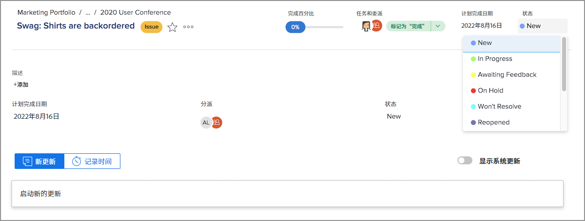
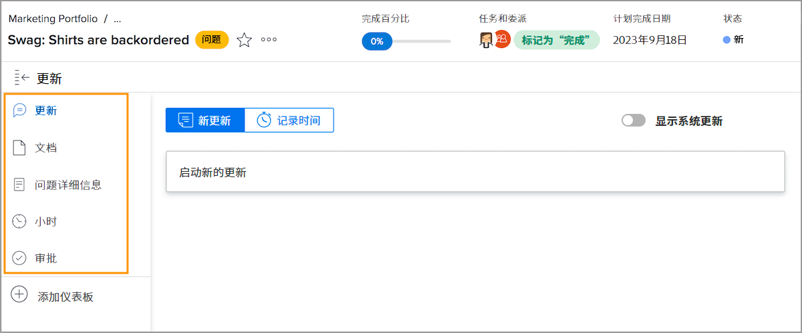

# 管理问题分配

## 分配问题

在 [!DNL Workfront] 是解决所出现问题的第一步。 下一步是将问题分配给单个用户、多个用户或团队，以便完成任何关联的工作并解决问题。

分配问题就像分配任务一样 — 填写 [!UICONTROL Assignments] 字段。 然后，问题会显示在受让人的 [!UICONTROL Work List] in [!DNL Workfront] [!UICONTROL Home]. 如果已分配给团队，则会在 [!UICONTROL Team Requests] 部分 [!UICONTROL Team] 页面。

已记录任务和项目本身的所有问题均可从 [!UICONTROL Issues] 的子目录访问Advertising Cloud帮助。 这允许项目经理、规划人员和其他人员快速分配与项目相关的问题。

在 [!DNL Workfront].

* 转到 [!UICONTROL Issue] 中的“隐藏主体”。 单击 [!UICONTROL Assignments] 字段以激活内联编辑，然后输入应完成工作的用户、用户或团队的名称。
在 [!DNL Workfront] 报表。

* 在报表或 **[!UICONTROL Issues]** 项目或任务的部分。 然后，单击 **[!UICONTROL Assignments]** 标题中的区域。 不要忘记单击 **[!UICONTROL Save]** 按钮。

![单击 [!UICONTROL Assignments] 问题字段](assets/04-issue-assign-issue-list-assignments-field.png)

<!--
Learn more graphic and documentation article links
Assign issues
Edit user assignments for multiple issues
-->

## 接收问题分配

在 [!UICONTROL Work List] in [!UICONTROL Home].

![中问题分配的图像 [!UICONTROL Work List] in [!UICONTROL Home]](assets/05-workfront-home-work-list.png)

使用 [!UICONTROL Filter] 菜单来缩小列表范围，以便您仅查看问题（如果需要）。

![图像 [!UICONTROL Filter] 菜单 [!UICONTROL Work List] in [!UICONTROL Home]](assets/06-workfront-home-issue-filter.png)

将问题分配给团队后，它会显示在 [!UICONTROL Team Requests] 部分 [!UICONTROL Team] 页面。 团队成员可以单击 [!UICONTROL Work On It] 按钮以接受分配，或团队主管可以单击 [!UICONTROL Reassign] 图标，以向特定人员发出请求。

![图像 [!UICONTROL Team Requests] 部分 [!UICONTROL Team] 页面](assets/07-team-page-work-on-it.png)

分配给团队的问题也会显示在 [!UICONTROL Schedule] 中。 这样，团队领导和其他人就可以在分配工作之前查看团队成员正在处理的工作。 从 [!UICONTROL Unassigned] 区域来分配。

![中的团队分配图像 [!UICONTROL Schedule] 中。](assets/08-issue-assignment-team-schedule.png)

取决于贵组织 [!DNL Workfront] 设置后，您还可以在功能板所包含的报表中看到分配给您或您的团队的问题。

<!-- Learn more graphic and documentation article links

* Display items in the [!UICONTROL Work List] in the [!UICONTROL Home] area
* Manage work and team requests in the [!UICONTROL Home] area

-->

## 更新问题进展

您和您的团队成员可以发布更新并记录问题的数小时，以便能够看到正在完成的工作，并让参与的每个人都了解工作进度的最新信息。

因为有多种方法可以在 [!DNL Workfront]，请按照团队有关与系统配置和工作流结合使用的推荐方式的特定说明进行操作。

有关此问题的更新和小时数，可从 [!UICONTROL Home]. 单击 **[!UICONTROL New Updates]** 来发布评论。

![在 [!UICONTROL Home].](assets/09-workfront-home-update.png)

在对问题发表评论时，您可以使用@name功能将消息定向给其他用户或团队，这与在社交媒体上的操作非常类似。

单击 **[!UICONTROL Log Time]** 按钮来记录您处理此问题的小时数。

![从中记录问题的小时数图像 [!UICONTROL Home].](assets/10-workfront-home-log-hours.png)

或者，您也可以打开问题（单击名称）并在此处记录您的信息。

## 订阅问题

有权查看问题的任何人都能够 [!UICONTROL Subscribe] 每次对问题进行更新/评论时，系统都会向它发送通知。 记录小时、更改状态或进行其他编辑时，您不会收到通知。

订阅是其他团队成员或项目经理跟踪其感兴趣但未被指派或积极工作的工作的绝佳方式。

<!-- Learn more graphic and link to documentation article

* Update or edit a work item in the Home area

-->

## 更新问题状态

除了发布评论或记录小时数之外，切记更改问题的状态以指示您正在处理该问题。 然后再次更改，以指示工作已完成。

将标题中的状态从 [!UICONTROL Home] 或打开问题页面时。

### 未解决的问题

当状态未更新为完成或等效时，系统会将问题视为“未解决”。

未解决的问题会阻止将与其关联的任务标记为已完成，并阻止将项目状态设置为完成。

<!-- Learn more graphic and documentation article link

* Mark a work item as done in the Home area

-->

## 有关问题的其他功能

“问题”(Issue)页面提供对团队成员和项目经理可能需要的其他信息和功能的访问权限，以便正确记录和管理问题以解决问题。

除 [!UICONTROL Updates] 和 [!UICONTROL Hours]，则打开问题后可从左侧面板菜单访问其他信息。

* **[!UICONTROL Documents]** — 上传和查看与问题相关的文档。
* **[!UICONTROL Issue Details]** — 更改问题信息，如说明、优先级、严重性和计划完成日期。
* **[!UICONTROL Approvals]** — 为发放设置一次性审批流程或应用全局审批流程。 在此部分中，您也可以跟踪审批进度。

在问题名称右侧的3个圆点菜单下，找到用于复制、删除或共享问题的选项。

<!-- Learn more graphic and documentation article links

* Edit issues
* Copy issues
* Share an issue
* Move issues
* Grant access to an issue

-->
