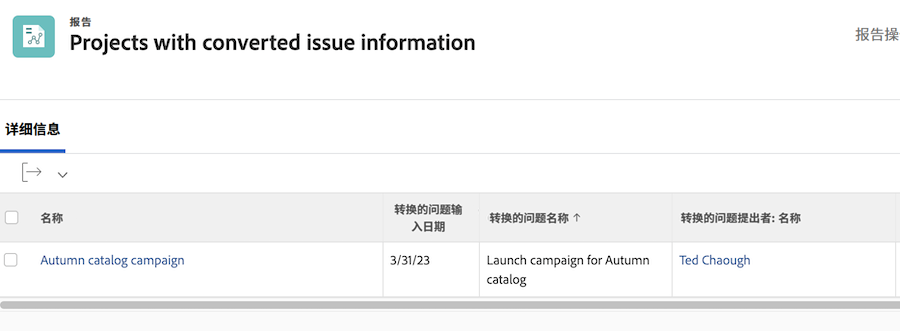

# 问题报告

## 通过创建报告来集中化问题

许多流量和项目经理都创建了 [!UICONTROL Workfront] 自定义报告以集中所有传入的问题。 这样，便可以轻松跟踪新增内容并需要关注。

然后，可以将该报表添加到功能板，将您完成工作所需的所有内容整合在一起 [!UICONTROL Workfront] 窗口。

![图像 [!UICONTROL Resolving Object] 列。](assets/18-resolving-object-report.png)

要显示问题已转换为的任务或项目的名称，请包括“[!UICONTROL Resolving Object]列。 A &quot;[!UICONTROL Resolving Object]“ ”是转换问题时创建的任务或项目。 如果问题未转换，则 [!UICONTROL Resolving Object] 字段将为空。 此报表可快速显示已转换的问题，因此您不会最终出现重复项。 只需单击解析对象名称以将其打开，即可跟踪完成工作的进度。

## 在报表中显示原始问题信息

有时，问题会转换为任务或项目，以便根据贵组织的工作流跟踪和监控解决该问题所需的工作。

项目或任务报表可显示有关原始问题的有用信息。 这些列可以添加到带有文本模式报表的自定义视图：

* [!UICONTROL Original Issue Entry Date]
* [!UICONTROL Original Issue Name]
* [!UICONTROL Original Issue Originator Name]

<!-- Need wf one documentation article link below

For the text mode used to create this report, see the article titled View: Display original issue information on task and project list.

-->

<!--  Learn more graphic and documentation article links

* Create and customize views
* Overview of resolving and resolvable objects
* Understanding resolving and resolvable objects

-->
