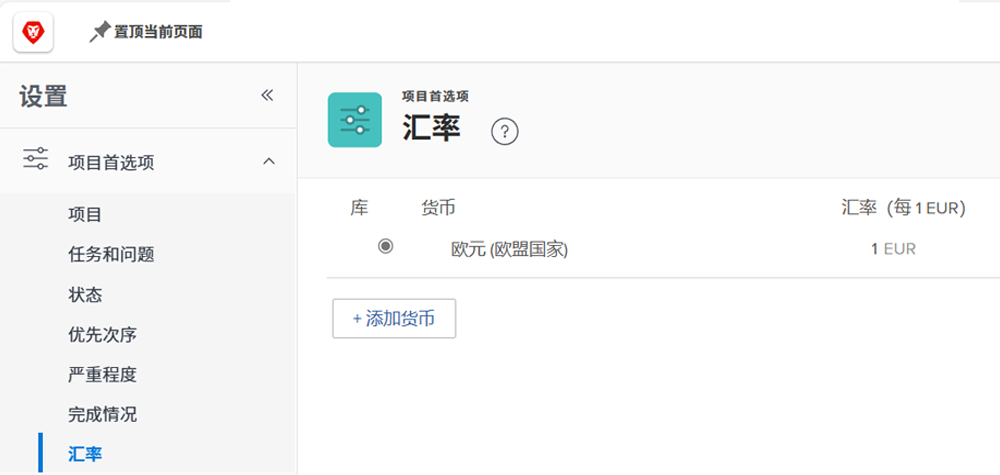
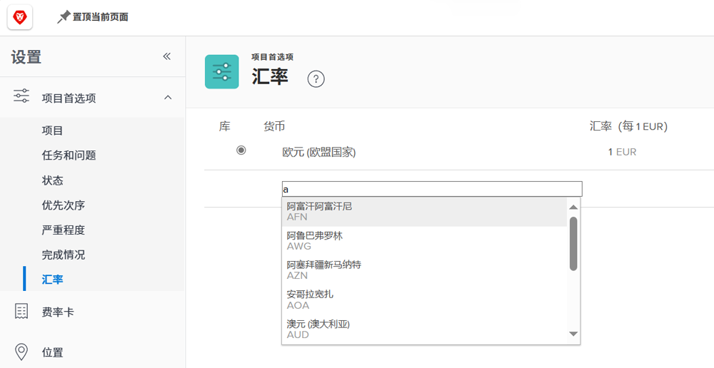

# 设置汇率

[!DNL Workfront] 为跨国公司的客户组织支持不同的货币。 可以在项目和报告中使用汇率，以反映世界各地不同货币的金融信息。

汇率由系统管理员管理。 您可以根据需要为您的组织设置其他币种。

[!DNL Workfront]的基准（默认）货币是美元。 这是默认计算财务信息的货币，除非在单个项目上指定了其他货币。

## 设置货币和汇率

**选择 [!UICONTROL Setup] 从主菜单。**

1. 展开 **[!UICONTROL Project Preferences]** 左侧菜单面板中。
1. 单击 **[!UICONTROL Exchange Rates]**.
1. 单击 **[!UICONTROL Add Currency]** 按钮。
1. 从下拉列表中选择国家/地区货币。
1. 输入币种的所需汇率。
1. 如果美元以外的货币应该是 [!DNL Workfront] 系统的基本（默认）货币，单击货币名称旁边的按钮。
1. 单击 **[!UICONTROL Save]** 添加所有货币后。

>[!NOTE]
>
>Workfront不更新或跟踪汇率的当前市值。 如有需要，必须手动进行更新。
