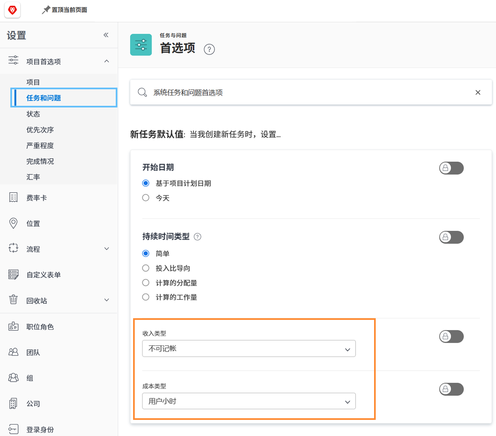

# 设置任务收入和成本默认值

收入类型和成本类型用于计算任务的计划和实际财务信息。 每个任务的默认信息都可以在系统范围内设置，因此适用于创建的每个新任务。 可以在单个项目中更改信息或在项目模板中设置信息。

**提供了五种默认收入类型：**

* 不可记帐
* 用户小时
* 角色小时
* 固定小时
* 固定收入

**并且提供了四种默认成本类型：**

* 无成本
* 固定小时
* 用户小时
* 角色小时

>[!NOTE]
>
>当收入或成本类型设置为“不可开单”或“无成本”时，则不会为任务生成收入和成本估计。 因此，任务上的工作不会对项目级别的收入或成本做出贡献。

## 设置收入和成本默认值

选择 **[!UICONTROL Setup]** 从主菜单。

1. 单击 **[!UICONTROL Project Preferences]** （在左侧面板菜单中）。
1. 然后单击 **[!UICONTROL Tasks & Issues]**.
1. 在 [!UICONTROL New Task Default] 部分，选择所需的 [!UICONTROL Revenue Type] 和 [!UICONTROL Cost Type].
1. 完成后单击保存。

