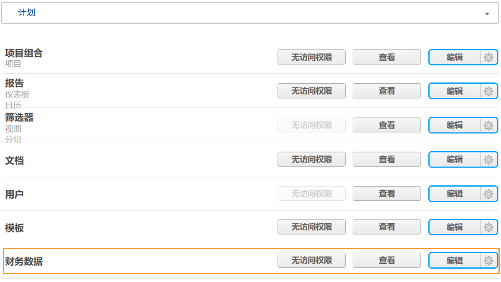
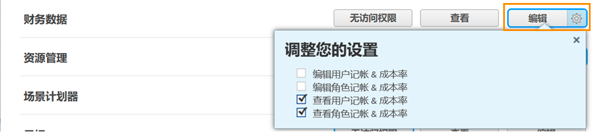

# 了解财务访问

如果贵组织使用 [!DNL Workfront]作为系统管理员，您有责任保护和管理有权查看和编辑该信息的人员。

要使用户查看或编辑财务信息，需要执行两项操作：

1. 必须在 [!UICONTROL Access Level].
2. 必须逐个对象授予使用这些访问权限的权限。

例如，用户可能被授予在其访问级别查看财务数据的权限，但他们只能查看与他们共享的任务的财务数据，并且在共享该任务时启用了财务查看。

因此，对于具有 [!UICONTROL Access Level] 查看财务报表的权限，以便能够查看某些对象而不是其他对象的财务报表，具体取决于这些对象的各个共享选项。 但是，除非用户在其 [!UICONTROL Access Level].

## [!UICONTROL Access Level] 设置

首先，授予对金融数据的整体访问权限 [!DNL Workfront] 许可证类型。

**[!UICONTROL Plan]许可证可以：**

* 管理帐单记录
* 管理和查看角色开单和成本费率
* 管理和查看用户账单和费率
* 管理费用
* 查看和编辑财务

**[!UICONTROL Work]许可证可以：**

* 管理费用
* 查看财务

**[!UICONTROL Review]许可证可以：**

* 查看财务

**权限可通过 [!UICONTROL Access Level]. 金融数据访问的三个选项是：**

* [!UICONTROL No Access]  — 用户将无法看到财务信息。
* [!UICONTROL View]  — 用户可以查看和共享信息。
* [!UICONTROL Edit]  — 用户可以创建、编辑、删除和共享信息。 （仅适用于计划许可证。）

请务必注意， [!UICONTROL View] 和 [!UICONTROL Edit] 选项具有 [!UICONTROL Plan] 许可证。 单击 [!UICONTROL View] 按钮：

**[!UICONTROL View]**

* 查看角色记帐 &amp; 成本率
* 查看用户记帐 &amp; 成本率

**[!UICONTROL Edit]**

这两个选项位于 [!UICONTROL Edit] 选项，以及：

* 编辑角色记帐 &amp; 成本率
* 编辑用户记帐 &amp; 成本率

>[!NOTE]
>
>有权添加费用的用户还可以查看他们添加的费用以及其直接报表添加的费用。
