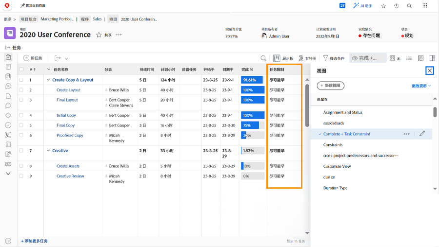

# 从项目时间线跟踪进度

确保任务按应有的方式进展，以达到项目最后期限。当您浏览 [!UICONTROL Task] 列表时，[!DNL  Workfront] 中有几个功能可以帮助您监测工作的进度和状态。

## 完成百分比

每项工作任务的完成百分比有时会用于衡量工作进展情况。值得注意的是......这个字段必须手动调整，因为它是受让人对他们的进度的估计。

>[!TIP]
>
>尽管工作任务的完成百分比需要手动更新，但父任务的完成百分比是由 Workfront 根据每个子任务的完成百分比以及持续时间或规划小时数来计算的。这意味着，如果您将大型任务分解为较小的子任务，则会提高完成百分比的准确度。

![显示 [!UICONTROL Percent Complete] 列的项目任务列表](assets/planner-fund-task-percent-complete.png)

完成百分比在三种情况下会自动更改：

* 当任务 [!UICONTROL Status] 设置为“完成”时，完成百分比会更改为 100。
* 如果任务 [!UICONTROL Status] 回滚到“新的”，则完成百分比会重置为 0。
* 在父任务中，当子任务的完成百分比发生变化时。

## 状态

在 [!UICONTROL View] 中加入 [!UICONTROL Status] 列，以快速查看哪些任务已开始、哪些正在进行中以及哪些已完成。您甚至可以在 [!UICONTROL View] 中设置条件格式，对每个状态进行颜色编码，使信息更容易解读。

## 任务分配

当您检查项目时，请检查任务分配。也许工作落后了，因为没有人分配这项任务。或者，分配的人员可能不具备完成工作所需的适当技能。向任务添加更多人员或重新分配任务以确保完成工作。

## 任务限制

有时任务限制会发生变化，而您却没有意识到。约束可能会影响时间线的行为方式，因此您应该确保它们是否按照您想要的方式设置。

创建一个包含 [!UICONTROL Task Constraint] 列的自定义视图，以便在任务列表中查看此信息。如果您从开始日期开始规划项目，则建议为您的任务设置 [!UICONTROL As Soon As Possible] ([!UICONTROL ASAP]) 限制。

有关任务限制的更多详细信息，请参阅[了解和管理持续时间类型和任务限制。](https://experienceleague.adobe.com/docs/workfront-learn/tutorials-workfront/manage-work/intermediate-projects/understand-and-manage-duration-types-and-task-constraints.html)
