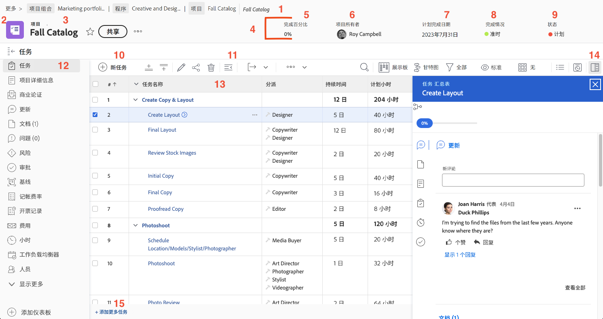

# 导航项目页面

本视频概述了如何在Workfront中导航和管理项目页面。 主要&#x200B;功能包括：

* **项目标题：**&#x200B;显示完成百分比、项目经理、计划完成日期、项目条件和状态等重要信息。 状态&#x200B;有助于跟踪项目的阶段并触发通知。  
* **痕迹导航导航：**&#x200B;显示项目在组织的项目和项目组合中的位置，其中带有可点击链接以方便导航。  
* **收藏夹和菜单：**&#x200B;收藏夹星形书签用于快速访问项目，而菜单提供编辑详细信息、复制项目和重新计算时间表等选项。  
* **任务列表：**&#x200B;表示项目计划中的步骤。 使用&#x200B;快速筛选器来查找任务，使用内联编辑来快速进行更改，使用任务摘要面板来了解详细信息。 单&#x200B;击任务名称将打开其专用页面。  
* **左侧面板：**&#x200B;提供对各种项目部分的访问权限，如详细信息、更新和文档。 系&#x200B;统管理员可以自定义面板。  
* **更新分区：**&#x200B;集中有关项目的通信，允许标记用户、回复评论和查看任务、问题和文档的汇总更新。  
* **文档部分：**&#x200B;允许上载和管理项目相关的文件和校样。 附加到任务的&#x200B;文档会汇总到项目级别以便轻松访问。  

>[!VIDEO](https://video.tv.adobe.com/v/335085/?quality=12&learn=on&enablevpops=1)

## 关键要点

* **项目标题概述：**&#x200B;快速访问关键项目详细信息，如完成百分比、项目经理、到期日期、状态和条件。 状态&#x200B;还控制通知和工作流暂存。  
* **任务管理：**&#x200B;使用任务列表跟踪项目步骤，应用快速筛选器查找任务并进行内联编辑。 通过摘要面板或任务页面访问&#x200B;详细的任务信息。  
* **痕迹导航导航：**&#x200B;使用痕迹导航跟踪中的可单击链接在组织内导航项目层次结构。  
* **集中式更新：**&#x200B;任务、问题和文档的所有更新汇总到项目更新部分，从而简化通信和跟踪。  
* **文档组织：**&#x200B;在文档部分上载和管理项目相关的文件和校样，确保相关文档已附加到任务以简化协作。  

## 项目页面中的关键部分

[单击此处](/help/assets/key-parts-of-the-project-page.pdf)下载此页面的 PDF。

项目页面中有许多功能，可以帮助您管理工作。 如果您需要一种选项，但在您的 [!DNL Workfront] 实例中没有看到该选项，请与您的系统管理员联系。 以下是一些需要注意的主要项目页面功能。

1. **痕迹导航路径：**&#x200B;浏览项目背后的项目群和项目组合层级。
2. **对象类型：**&#x200B;在登陆页面上显示对象类型有助于您识别在 [!DNL Workfront] 中看到的内容。 “项目”术语可由您 [!DNL Workfront] 系统管理员自定义。
3. **项目名称：**&#x200B;您正在查看的项目的名称。 单击名称进行编辑。
4. **项目标题：**&#x200B;所有项目页面上都提供的标准信息。
5. **[!UICONTROL Percent complete]：**&#x200B;这会根据项目中完成的任务自动更新。
6. **[!UICONTROL Project Owner]：**&#x200B;在大多数组织中，这是项目经理， 这是负责管理 [!DNL Workfront] 中的项目并确保其完成的人员。
7. **[!UICONTROL Planned Completion Date]：**&#x200B;项目的规划完成日期由项目经理通过项目时间线设定。
8. **[!UICONTROL Condition]：**[!UICONTROL Condition] 是项目进展情况的直观呈现。 [!DNL Workfront] 可以根据项目中任务的进度状态自动配置 [!UICONTROL Condition]。 或者 [!UICONTROL Condition] 可以通过项目详细信息手动设置。
9. **[!UICONTROL Status]：**[!UICONTROL Status] 指示项目所处的流程阶段：项目是否仍在规划中、项目是否正在进行或项目中的所有工作是否已完成。
10. **[!UICONTROL New Task]：**&#x200B;单击可在项目中创任务。 任务在列表底部生成。
11. **[!UICONTROL Export]:** 将任务列表或选定的任务导出为 PDF、电子表格或制表符分隔文件。
12. **左侧面板菜单：**&#x200B;使用左侧面板导航至有关项目的不同信息。 如果您的屏幕上需要更多空间，请单击顶部的任务图标以折叠面板。 拖放图标，以便相应的顺序帮助您高效工作。 您看到的选项由您的 [!DNL Workfront] 系统管理员设置。
13. **任务列表：**&#x200B;任务列表显示构成项目计划的所有任务。 有关每个任务的可见信息由所选视图决定。
14. **摘要面板：** 摘要面板提供有关所选任务的快速查看信息。 单击摘要面板图标可打开或关闭。
15. **添加更多任务** 单击此处可使用内联编辑将另一个任务添加到任务列表的底部。

## 有关此主题的推荐教程

* [了解基本项目创建](/help/manage-work/projects/understand-basic-project-creation.md)
* [了解创建项目的四种方法](/help/manage-work/projects/understand-other-ways-to-create-projects.md)
* [填写项目详细信息。](/help/manage-work/projects/fill-in-the-project-details.md)

