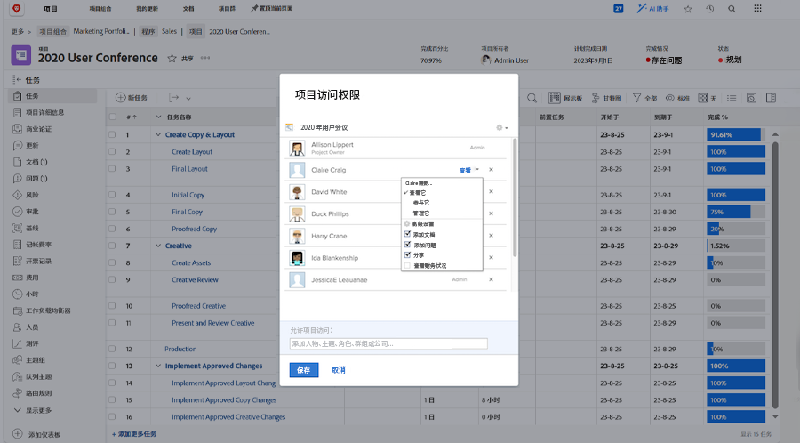

# 共享项目

让利益相关方和协作者了解项目是管理项目的一个重要部分。

通过共享项目，确保每个人都能看到所需的信息。 在Workfront中，这是通过 [!UICONTROL Share] 选项。 您可以在单个项目中，通过 [!UICONTROL More] 菜单。

或者，您也可以从 [!UICONTROL Projects] 页面，方法是选择项目并单击 [!UICONTROL Share] 按钮。

通过共享项目，参与的每个人都可以在需要时查看项目信息。

<!---
Learn More Icon
Share permissions on objects
Share a project
--->
