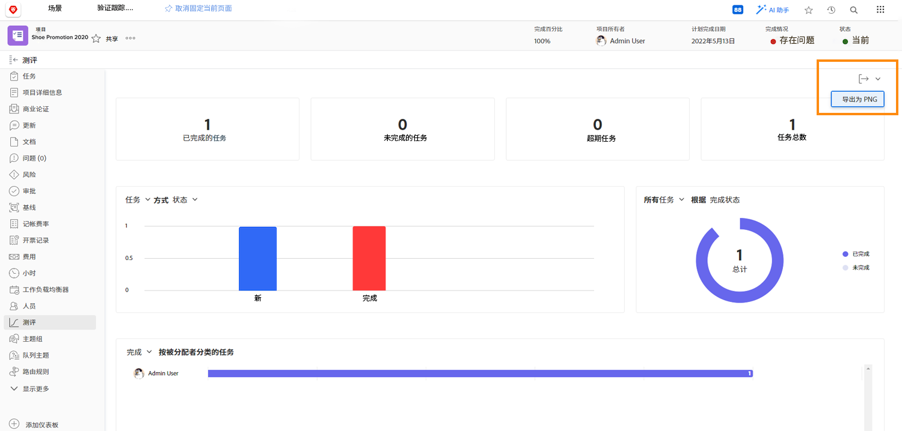

# 使用项目量度跟踪工作进度

在本视频中，您将学习如何：

* 访问项目量度图表
* 自定义图表中的信息

>[!VIDEO](https://video.tv.adobe.com/v/336667/?quality=12&learn=on)

您可以将整个项目量度功能板导出为.png文件，其中包含 [!UICONTROL Export] 按钮。 这使得通过电子邮件或演示文稿与他人共享数据变得很容易。

<!---
Overview of project metrics
--->
