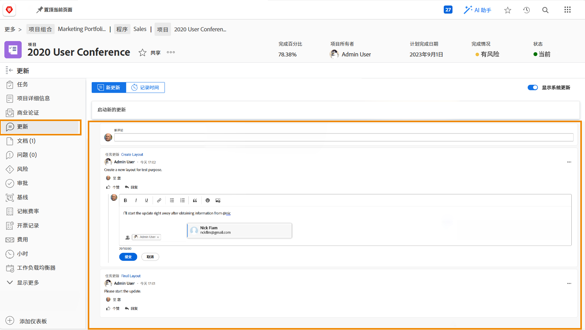

# 了解项目通信

正如俗话所说，管理项目的90%是沟通。 与项目团队、您的经理和项目利益相关方进行沟通。

但是，当项目团队使用电子邮件、即时消息、会议和便笺进行项目通信时，信息会被分散……或者更糟，被遗忘。 在 [!DNL Workfront] 使用更新。

由于项目团队成员正在处理分配，因此他们可以从 [!DNL Workfront] [!UICONTROL Home] 任务。

从任务、问题和文档更新汇总到项目级别 [!UICONTROL Updates] 选项卡，使信息快速且易于查看。

然后，您只需单击按钮即可回复更新。 这会将所有对话保留在一个位置，以便您稍后再回顾它。

<!---
learn more urls
Communicate about work in Home
Subscribe to items in Workfront
Update work
--->
