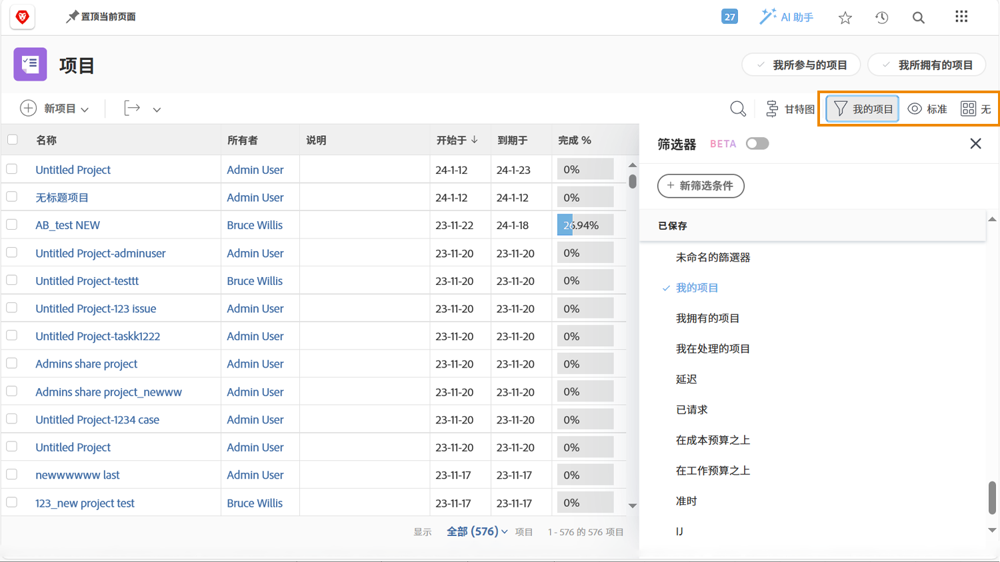
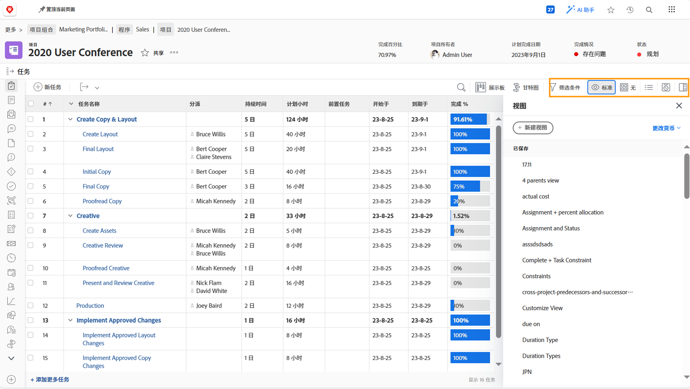

# 查看项目信息

无论您是查看 [!UICONTROL Projects] 主页还是查看单个项目，请微调您的列表，利用 [!UICONTROL Filters]、[!UICONTROL Views] 和 [!UICONTROL Groupings] 查看所需的信息。

您可以在 [!UICONTROL Projects] 页面中从总体上了解所有项目的进展情况。

使用 [!UICONTROL Filters] 根据某些标准缩小列表范围。然后选择一个 [!UICONTROL View]，以显示与您的项目相关的信息列。最后，选择一个 [!UICONTROL Grouping]，以适合您的方式组织项目。

当您在项目的 [!UICONTROL Tasks] 部分时，再次利用 [!UICONTROL Filters]、[!UICONTROL Views] 和 [!UICONTROL Groupings] 来帮助您监测正在完成的工作。因为您关注的是任务而不是项目，所以您有一组完全不同的选择。

许多 [!DNL Workfront] 客户会创建自定义视图，以显示自定义表单信息以及与正在完成的工作相关的其他字段。

## 了解如何创建自定义过滤器、视图和分组

[创建基本过滤器](https://experienceleague.adobe.com/docs/workfront-learn/tutorials-workfront/reporting/basic-reporting/create-a-basic-filter.html?lang=zh-Hans)

[创建基本视图](https://experienceleague.adobe.com/docs/workfront-learn/tutorials-workfront/reporting/basic-reporting/create-a-basic-view.html?lang=zh-Hans)

[创建基本分组](https://experienceleague.adobe.com/docs/workfront-learn/tutorials-workfront/reporting/basic-reporting/create-a-basic-grouping.html?lang=zh-Hans)
