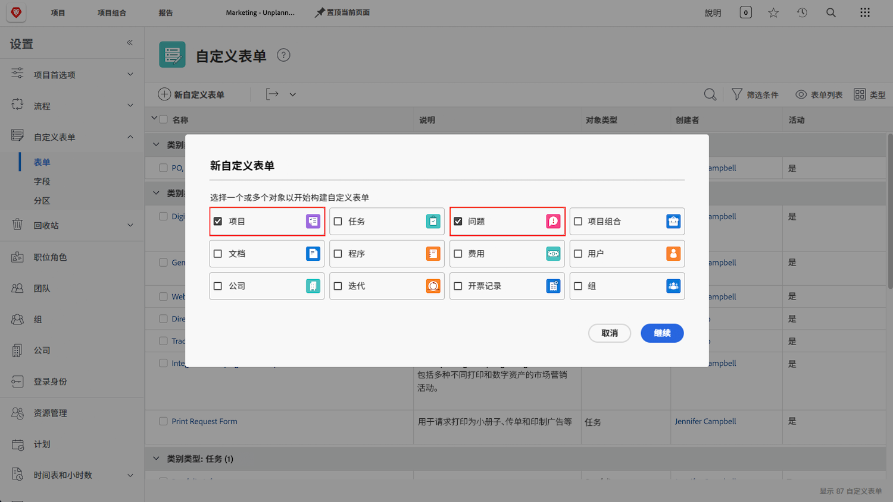
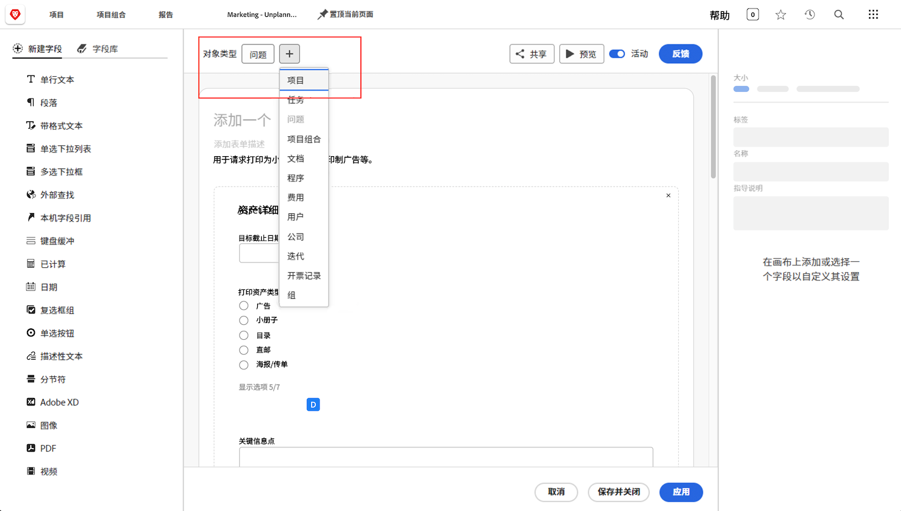

# 有关请求队列的常见问题解答

**为什么我可以看到请求队列，但我的用户看不到？**

在您的请求队列/项目的 [!UICONTROL Queue Details] 选项卡中，确保您的用户符合“谁可以向该队列添加请求？”字段的标准。

观看此视频，了解更多详细信息：

>[!VIDEO](https://video.tv.adobe.com/v/3434156/?quality=12&learn=on)

**我授予了用户访问队列的权限，但现在他们还可以看到请求队列项目。为什么？**

在“谁可以将请求添加到此队列？”中， 列表，如果您选择“拥有查看此项目访问权限的用户”，则您授予查看权限以使用请求队列的任何人都将能够查看项目列表中的请求队列。 要避免出现这种情况，请使用“此项目所在公司的人员”或“此项目组中的人员”选项。

**我可以将请求转化为项目吗？**

可以。您可以根据需要将问题转换为任务或项目。

这些教程将向您展示如何执行以下操作：

* [将问题/请求转化为项目](/help/manage-work/issues-requests/create-a-project-from-a-request.md)

* [将问题/请求转化为任务](/help/manage-work/issues-requests/convert-issues-to-other-work-items.md)

**在哪里可以找到要进行编辑的请求队列？**

您可以使用导航栏中的 [!UICONTROL Search] 字段或在 [!UICONTROL Projects] 区域中找到它。

如果从请求队列中打开请求，则可以单击痕迹导航区域中的项目名称。

**我可以将信息从请求自定义表单传输到项目自定义表单吗？**

可以。创建自定义表单时，请同时选择 [!UICONTROL Project] 和 [!UICONTROL Issue] 作为对象类型。您还可以编辑项目自定义表单以包括问题对象类型，反之亦然。

在请求中附加自定义表单。当您将请求转化为项目时，自定义表单会自动附加到新项目中，并且所有字段中包含的值都会同时显示在请求自定义表单和项目自定义表单中。

**我正在查看一份项目或任务报告。我如何找出该对象源自哪个请求？**

您可以访问 **[!UICONTROL Converted Issue]** 和 **[!UICONTROL Converted Issue Originator]** 字段源中的字段，以将这些信息添加到项目和任务报告中。

观看此视频，了解更多详细信息：

>[!VIDEO](https://video.tv.adobe.com/v/3434176/?quality=12&learn=on)

**在报告中过滤请求队列的最佳方法是什么？**

如果您的项目过滤器包括&#x200B;**队列>>为公共>>等于>>无**，则您的报告仅会显示属于&#x200B;**非**&#x200B;请求队列的项目。

如果您的项目过滤器包括&#x200B;**队列>>为公共>>不等于>>无**，则您的报告仅会显示&#x200B;**属于**&#x200B;请求队列的项目。

观看此视频，了解更多详细信息：

>[!VIDEO](https://video.tv.adobe.com/v/3434329/?quality=12&learn=on)

**创建“请求队列”的自定义状态是否更好？**

有些客户会创建与“当前”等同的“请求队列”自定义状态。 然后，他们可以运行显示所有请求队列的报告，也可以轻松地从报告中排除请求队列。 与使用&#x200B;**Queue>>Is Public>>Not Equal>>None**&#x200B;相比，这种方式的用户友好性更高，但是它的缺点是，创建请求队列的用户可能会忘记使用它，因为“当前”状态的工作方式同样有效，并且这也是他们将在大多数培训资料中看到的内容。 因此，许多客户选择不使用请求队列的自定义状态。

但是，如果您已在组织中使用请求队列状态，并且只是希望能够确保该状态被正确使用（或修复未正确使用请求队列的情况），则可以创建上视频中描述的&#x200B;**活动请求队列**&#x200B;报告，并更改&#x200B;**项目>>状态等于等于>>等于>>当前**&#x200B;到&#x200B;**项目>>状态>>等于>>当前**&#x200B;的筛选器。 这将显示所有使用当前状态而不是您希望它们使用的请求队列状态的活动请求队列。 选择出现的所有项目并进行批量编辑，将状态更改为请求队列。

## 有关此主题的推荐教程

* [了解请求队列](/help/manage-work/request-queues/understand-request-queues.md)
* [创建请求队列](/help/manage-work/request-queues/create-a-request-queue.md)
* [了解请求流量的设置](/help/manage-work/request-queues/understand-settings-for-a-flow-request.md)
* [创建请求流量](/help/manage-work/request-queues/create-a-request-flow.md)
* [创建系统管理员反馈请求队列](/help/manage-work/request-queues/create-a-system-admin-feedback-request-queue.md)
