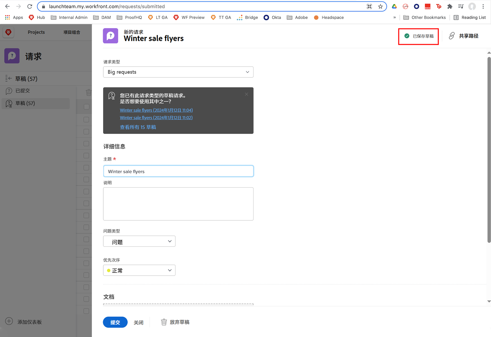
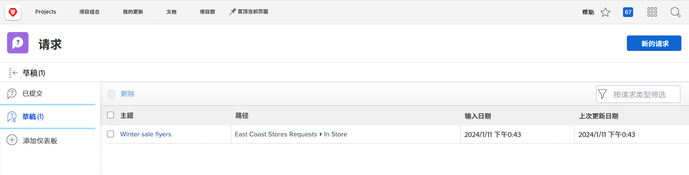

# 了解请求队列

在本视频中，您将了解到：

* 如何通过 [!DNL  Workfront] 请求队列提交请求
* 请求队列的结构是如何设置的

>[!VIDEO](https://video.tv.adobe.com/v/335220/?quality=12&learn=on)

## 请求草稿会自动保存

当您开始填写请求表时，[!DNL Workfront] 会在填写 [!UICONTROL Subject] 字段后自动保存草稿。这意味着，如果您需要离开 [!UICONTROL Requests] 区域进行其他操作，或者为了收集更多信息需要在请求中间暂停，丢失不会数据。

您会在窗口顶部看到草稿已保存的指示。即使尚未填写必填字段，[!DNL Workfront] 也会保存您的请求的草稿。

当您准备好提交请求时，请在 [!UICONTROL Drafts] 选项卡中找到它。单击名称将其打开并完成表格填写。然后当您完成时单击 [!UICONTROL Submit Request]。

## 到您了

让我们花一点时间回顾一下刚才向您展示的信息。

**问题：**&#x200B;如何在 Workfront 中提出请求？按顺序列出步骤。

* 选择您需要提出的请求类型
* 单击提交请求
* 填写表格上的信息
* 单击“新请求”
* 导航至请求区域

**答案：**&#x200B;导航至请求区域 > 单击“新建请求”> 选择您需要提出的请求类型 > 填写表单上的信息 > 单击“提交请求”

**问题：**&#x200B;请求实际上是一个......

**答案：**&#x200B;问题

<!---
You can also access request drafts from the [!UICONTROL Select a Request Type] menu at the top of the window. Select an option from the [!UICONTROL Recent Drafts] section, or start a new request by picking a queue from the [!UICONTROL New Requests] section. Fill everything out like normal, then submit the request.

<!---
image
--->

<!---
Let's take a minute to review the information you were just presented.

How do you make a request in Workfront? List the steps in order.
Choose the request type you need to make
Click Submit request
Fill out the information on the form
Click "New Request"
Navigate to the request area

Answer: Navigate to the request area>Click New Request>Choose the request type you need to make>Fill out the information on the form>Click Submit request

A request is really an......

Answer: Issue
--->
