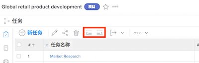
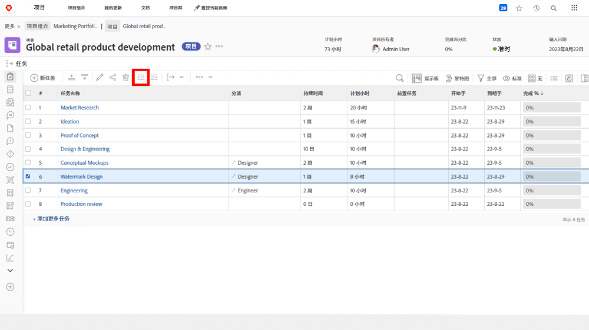
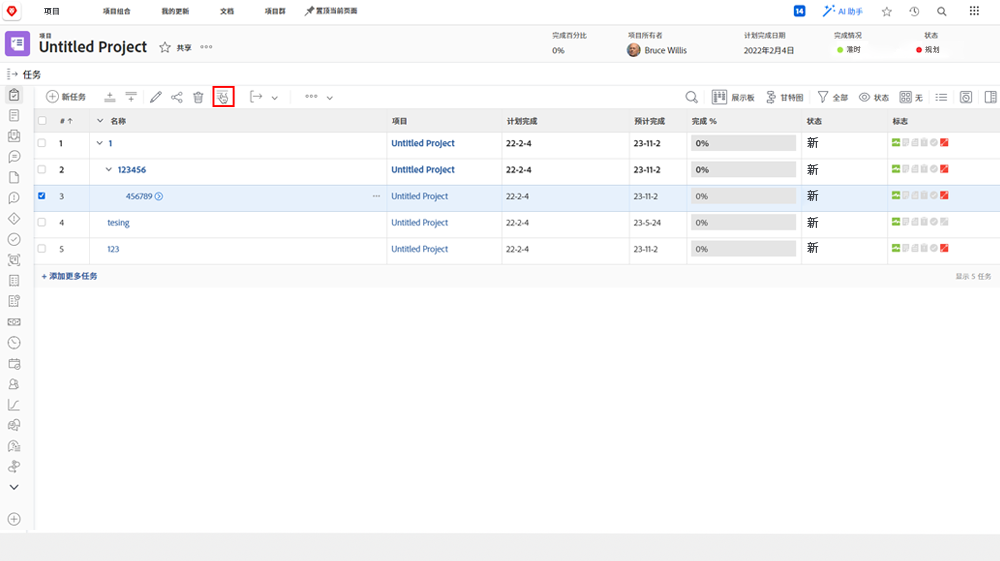

# 了解父任务-子任务

在本视频中，您将了解到：

* [!DNL Workfront] 项目中的任务结构

>[!VIDEO](https://video.tv.adobe.com/v/335087/?quality=12&learn=on)

## 将任务更改为子任务，然后再改回来

**缩进**&#x200B;和&#x200B;**减少缩进**&#x200B;按钮用于将任务更改为子任务或将子任务更改为非子任务。

选择“[!UICONTROL Watermark Design]”并单击&#x200B;**缩进**&#x200B;按钮。“[!UICONTROL Watermark Design]”将会成为“[!UICONTROL Conceptual Mockups]”下的子任务，而后者则会成为父任务。

如果是子任务，请选择“[!UICONTROL Watermark Design]”，然后单击&#x200B;**缩进**&#x200B;按钮。“[!UICONTROL Watermark Design]”将会成为与 “[!UICONTROL Conceptual Mockups]”具有相同级别的常规任务。

