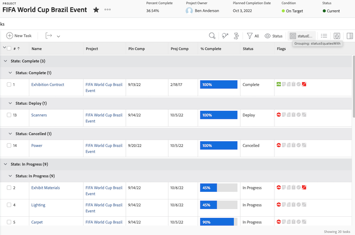
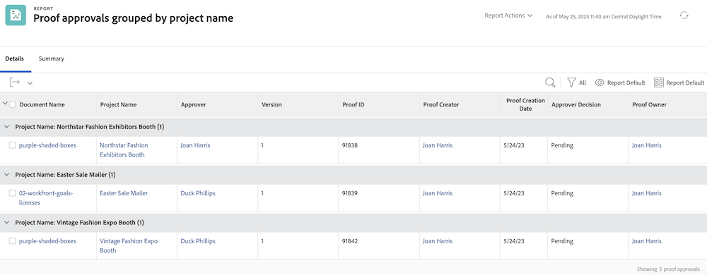

# 了解分组的基本文本模式

>[!PREREQUISITES]
>
>* [了解报告要素](https://experienceleague.adobe.com/docs/workfront-learn/tutorials-workfront/reporting/basic-reporting/reporting-elements.html?lang=zh-Hans)
>* [了解报告组件](https://experienceleague.adobe.com/docs/workfront-learn/tutorials-workfront/reporting/basic-reporting/reporting-components.html?lang=zh-Hans)
>* [创建基本分组](https://experienceleague.adobe.com/docs/workfront-learn/tutorials-workfront/reporting/basic-reporting/create-a-basic-grouping.html?lang=zh-Hans)


>[!TIP]
>
>* 为了更深入地了解文本模式，我们建议观看录制的网络研讨会活动[咨询专家 - 文本模式报告简介](https://experienceleague.adobe.com/docs/workfront-events/events/reporting-and-dashboards/introduction-to-text-mode-reporting.html?lang=zh-Hans)，时长为一小时。
>* 要了解有关文本模式的更多信息，我们建议观看[高级报告](https://experienceleague.adobe.com/docs/workfront-learn/tutorials-workfront/reporting/advanced-reporting/welcome-to-advanced-reporting.html?lang=zh-Hans)教程，总共为五个半小时。
>* 单击此处以访问 [[!UICONTROL API Explorer]](https://developer.adobe.com/workfront/api-explorer/)

在本视频中，您将了解到：

* 什么是文本模式
* 什么是驼峰式拼写
* 您可以在分组中使用一些基本的“即插即用”文本模式

>[!VIDEO](https://video.tv.adobe.com/v/3410641/?quality=12&learn=on)

## 任务 - 四个父级分组

以下文本模式将根据最多四个级别的父级对任务进行分组，并将不存在的父级留空。

```
textmode=true
group.0.name=Parents
group.0.valueexpression=CONCAT({parent}.{parent}.{parent}.{parent}.{name},IF(ISBLANK({parent}.{parent}.{parent}.{parent}.{name}),"",", "),{parent}.{parent}.{parent}.{name},IF(ISBLANK({parent}.{parent}.{parent}.{name}),"",", "),{parent}.{parent}.{name},IF(ISBLANK({parent}.{parent}.{name}),"",", "),IF(ISBLANK({parent}.{name}),"No parent",{parent}.{name}))
group.0.linkedname=parent
group.0.namekeyargkey.0=parent
group.0.namekeyargkey.1=name
group.0.valueformat=string
```


## 任务 - 分组完成百分比

以下文本模式将根据任务的完成百分比对任务进行分组。分组时，任务将属于以下类别之一：

* 0%
* 1% 至 25%
* 26% 至 50%
* 51% 至 75%
* 76% 至 99%
* 100%

```
group.0.linkedname=direct
group.0.namekey=percentComplete
group.0.valueexpression=IF({percentComplete}<1,"0%",IF({percentComplete}<26,"1% to 25%",IF({percentComplete}<51,"26% to 50%",IF({percentComplete}<76,"51% to 75%",IF({percentComplete}<100,"76% to 99%",IF({percentComplete}=100,"100","***"))))))
group.0.valueformat=doubleAsString
textmode=true
```


## 任务 - 按 statusEquatesWith 分组，然后按状态分组

以下文本模式将按 statusEquatesWith 对任务进行分组，然后按状态进行分组。

```
group.0.enumclass=com.attask.common.constants.TaskStatusEnum
group.0.enumtype=TASK
group.0.linkedname=direct
group.0.name=State
group.0.type=enum
group.0.valuefield=statusEquatesWith
group.0.valueformat=val
group.1.enumclass=com.attask.common.constants.TaskStatusEnum
group.1.enumtype=TASK
group.1.linkedname=direct
group.1.namekey=status
group.1.type=enum
group.1.valuefield=status
group.1.valueformat=val
textmode=true
```




## 验证审批 - 按项目名称分组

```
group.0.valueformat=HTML
group.0.valuefield=documentVersion:document:project:name
group.0.displayname=Project Name
```




## 验证审批 - 按文档名称分组

```
group.0.displayname=Document Name
group.0.valuefield=documentVersion:document:name
group.0.valueformat=HTML
```


