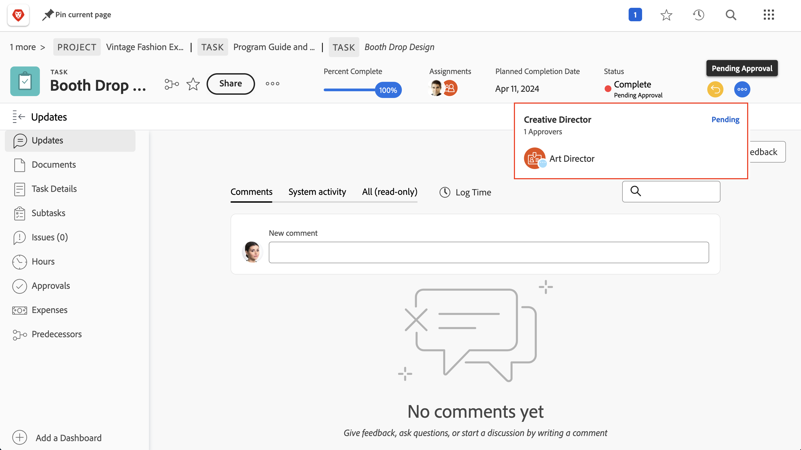

# 完成审批

任务和问题的审批是许多项目的一部分。但未解决的审批会造成您无法将项目状态设置为“完成”。

以下是找到它们并处理它们的方法。

在项目的[!UICONTROL Task] 部分，选择包含[!UICONTROL Status]列的[!UICONTROL View]，例如[!UICONTROL Status]视图。快速浏览该列将显示是否有任务在状态名称后带有“[!UICONTROL - Pending Approval]”字样的未完成审批。

当您发现仍在等待审批的任务时，您有两个选择可以采取行动：

## 完成审批

这可能意味着提醒被分配的人注意未完成的审批。您可以通过打开任务并点击审批区域中的三点菜单来查看谁被指定为审批者。

将出现一个框，显示被分配的审批者。

## 移除审批

如果不需要审批，您可能想要移除它。您可以通过首先撤回审批来做到这一点。点击审批区域中的[!UICONTROL Recall]按钮。这将把状态更改回之前的状态，并允许您移除审批流程。

现在点击左侧的[!UICONTROL Approvals] 标签，然后点击右上角的[!UICONTROL Remove]按钮。

## 处理问题审批

如果您的组织使用问题来跟踪开展项目期间的问题、更改指令或其他事件，请按照项目 [!UICONTROL Issues] 部分的相同步骤进行操作。
