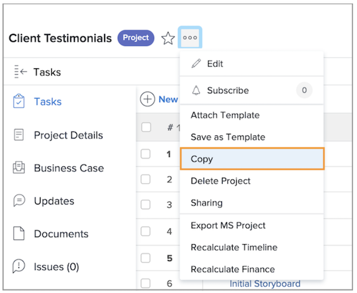

# 复制现有项目

有时，您只需要复制一个项目以供一次性使用，而不需要使用模板来创建项目。 为此，您必须拥有标准许可，并具有编辑和创建项目的访问权限。

导航到要复制的项目，然后单击项目名称旁边的三点菜单。 然后选择“复制”。

通过“复制项目”窗口，您可以更改标题和状态，以及清除与项目关联的各种数据——例如分配、文档和自定义数据等选项。

选择“清除分配”或将状态设置为“规划中”可防止复制的项目在复制后直接发送任务分配通知。

## 有关此主题的推荐教程

* [直接从模板创建项目](/help/manage-work/create-and-manage-project-templates/create-a-project-directly-from-a-template.md)
* [处理任务](/help/manage-work/tasks/work-with-tasks.md)
* [从项目规划中分配任务](/help/manage-work/tasks/assign-tasks-from-the-project-plan.md)
