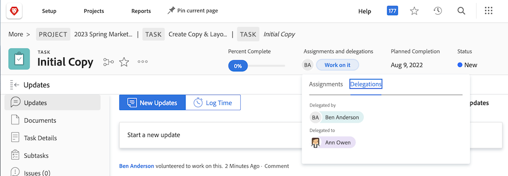

# 委派任务、问题和审批

了解如何将项目、任务、问题和考勤卡的审批委派给 Workfront 的其他用户。此外还可了解如何委派任务和分配问题。

## 委派审批

了解如何将项目、任务、问题和考勤卡的审批委派给其他用户。

在本视频中，您将学习如何：

* 将审批任务分配给其他人
* 结束委托期限
* 查看已委托的审批任务

>[!VIDEO](https://video.tv.adobe.com/v/336094/?quality=12&learn=on)

<!---
learn more URLS
Delegate approval request
--->

## 委派任务和分配问题

当您计划休息时间时，您可以将分配给您的任务和问题委派给其他用户。

### 如何启用任务和问题分配委派功能

在使用之前，必须由组或系统管理员启用任务和问题委派功能。这可在 [!UICONTROL Setup > Project Preferences > Tasks & Issues > Delegation] 中进行。启用此功能将会允许所有拥有审阅或更高级别许可证的用户委派分配给他们的任务和问题。

![显示 [!UICONTROL Setup] 委派首选项的屏幕快照](assets/delegation-1.png)

### 如何委派任务和分配问题

导航至 [!UICONTROL Home]，并单击 [!UICONTROL Delegate]，然后指定将所有分配任务委派给的用户以及日期范围。您可以指定任何具有审核或更高级别许可证的用户。

![显示委派选项卡的屏幕快照，位于 [!UICONTROL Home]](assets/delegation-2.png)

### 如何判断某项任务或问题是否已委派

您可以在 [!UICONTROL Home] 或者任务或问题视图中查看何时委派了任务或问题。

![显示已委派任务分配的屏幕快照，位于 [!UICONTROL Home]](assets/delegation-4.png)

### 适用于已委派工作的电子邮件通知

您的组或系统管理员可以启用电子邮件通知，以便您知道您的任务和问题何时受到了委派，以及某人的任务和问题何时委派给了您。

![显示有关委派活动的 [!UICONTROL Setup] 电子邮件通知选项的屏幕快照](assets/delegation-5.png)

