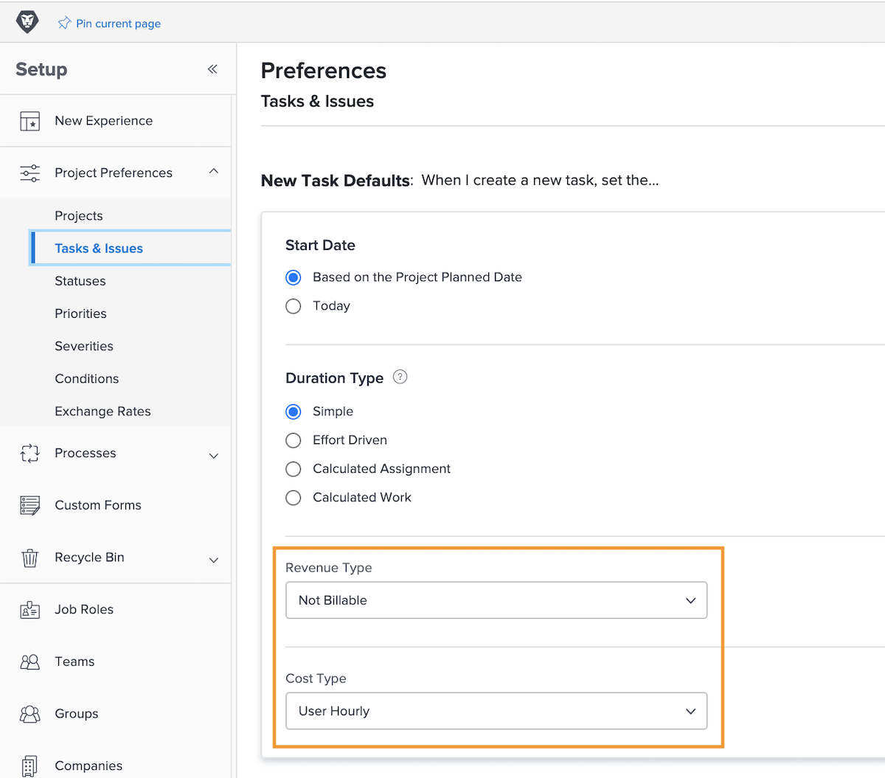

# 设置任务收入和成本默认值

使用收入类型和成本类型来计算任务的规划和实际财务信息。其中每个任务的默认信息都可以在系统范围内进行设置，因此它会应用于所创建的每个新任务。可以在单个项目上更改该信息或在项目模板上进行设置。

**有五种默认收入类型可用：**

* 不可计费
* 用户每小时
* 角色每小时
* 固定每小时
* 固定收入

**有四种默认成本类型可用：**

* 无成本
* 固定每小时
* 用户每小时
* 角色每小时

>[!NOTE]
>
>当收入或成本类型设置为“不可计费”或“无成本”时，不会为任务生成收入和成本估算信息。因此，该任务的工作不会增加项目级别的收入或成本。

## 设置收入和成本默认值

从主菜单中选择 **[!UICONTROL Setup]**。

1. 单击左侧面板菜单中的 **[!UICONTROL Project Preferences]**。
1. 然后单击 **[!UICONTROL Tasks & Issues]**。
1. 在 [!UICONTROL New Task Default] 部分，选择所需的 [!UICONTROL Revenue Type] 和 [!UICONTROL Cost Type]。
1. 完成后单击“保存”。

