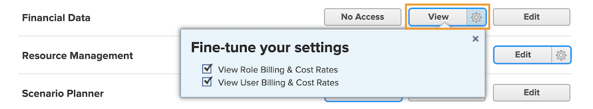

# 了解财务访问权限

如果您的组织使用 [!DNL Workfront] 捕获所有财务数据，作为系统管理员，您有责任保护和管理有权查看和编辑该信息的人员。

用户查看或编辑财务信息需要满足两个条件：

1. 必须在 [!UICONTROL Access Level] 中启用访问权限。
2. 必须逐个对象授予使用这些访问权限的权限。

例如，用户可能具有在其访问级别上查看财务数据的权限，但只有在与其共享任务，并且在共享该任务时启用了财务查看功能的情况下，用户才能查看该任务的财务信息。

因此，拥有查看财务信息 [!UICONTROL Access Level] 权限的用户可以查看某些对象的财务信息，而不能查看其他对象的财务信息，具体取决于这些对象的单独共享选项。但是，任何用户都不能查看任何对象的财务信息，除非他们在其 [!UICONTROL Access Level] 中获得了相应的权限。

## [!UICONTROL Access Level] 设置

对财务数据的全面访问权限首先由 [!DNL Workfront] 许可证类型授予。

**[!UICONTROL Plan]许可证可以：**

* 管理账单记录
* 管理和查看角色计费和成本费率
* 管理和查看用户计费和成本费率
* 管理费用
* 查看和编辑财务信息

**[!UICONTROL Work]许可证可以：**

* 管理费用
* 查看财务信息

**[!UICONTROL Review]许可证可以：**

* 查看财务信息

**权限可以通过 [!UICONTROL Access Level] 进行修改。财务数据访问权限的三个选项是：**

* [!UICONTROL No Access]—用户无法看到财务信息。
* [!UICONTROL View]—用户可以查看和共享信息。
* [!UICONTROL Edit]—用户可以创建、编辑、删除和共享信息。（仅适用于“计划”许可证。）

需要注意的是，[!UICONTROL View]和[!UICONTROL Edit]选项具有用于[!UICONTROL Plan]许可证的附加设置。 单击 [!UICONTROL View] 按钮上的齿轮以获得这些选项：

**[!UICONTROL View]**

* 查看角色计费 &amp; 成本费率
* 查看用户计费 &amp; 成本费率

**[!UICONTROL Edit]**

这两个选项以及以下内容在 [!UICONTROL Edit] 选项下可用：

* 编辑角色计费 &amp; 成本费率
* 编辑用户计费 &amp; 成本费率

>[!NOTE]
>
>有权添加费用的用户还可以查看他们添加的费用，以及由其直接下属添加的费用。
