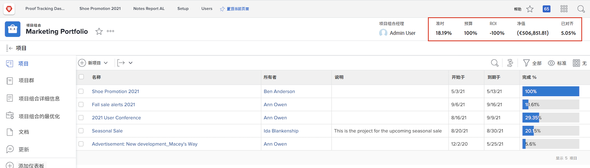
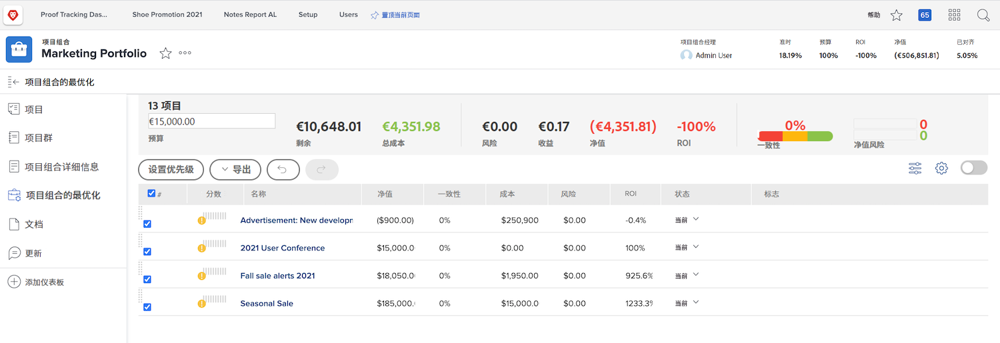
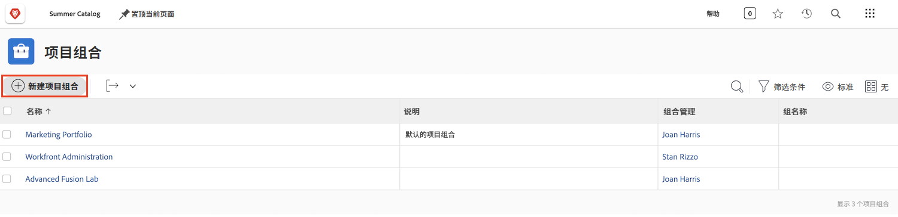
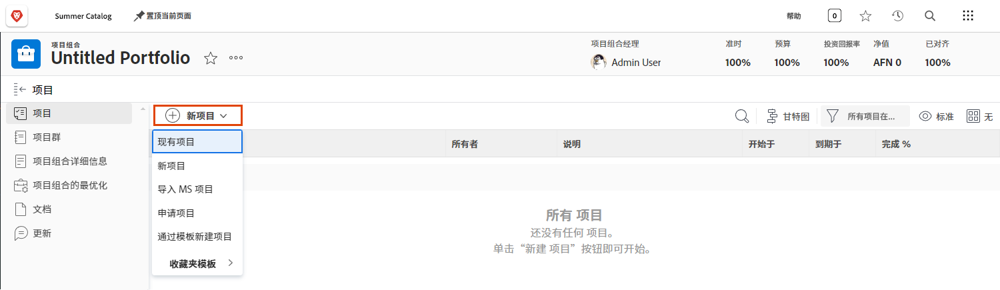
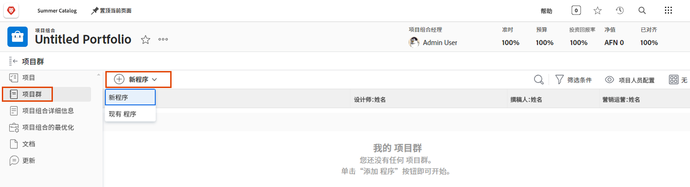

# 了解项目组合

管理人员经常面临一项棘手的工作，即确定哪些项目最能帮助公司实现其目标。这意味着根据这些目标的重要标准来判断当前或潜在的项目。该标准可以包括所需资源的数量、项目成本与收益的对比以及理解所涉及的风险等。有了这些信息，管理人员就可以决定应该完成哪些项目以及何时完成。

构思和规划项目并不是一项过于困难的任务——这是大多数管理人员都习惯的过程。真正的困难在于相互比较项目。过滤一长串详细的项目清单非常耗时。这就是 Workfront 中的项目组合可以提供帮助的地方。

## 什么是项目组合？

项目组合是争夺相同资源、预算、计划和优先级的项目的集合。例如，营销机构可能会使用项目组合来对特定客户的所有项目进行分组。

从 [!UICONTROL Main Menu] 导航到 **[!UICONTROL Portfolios]** 部分，然后单击项目组合名称将其打开。

您可以使用 **[!UICONTROL New Project]** 按钮轻松地将现有项目添加到项目组合中。或者您可以直接在项目组合中创建一个新项目。

![[!UICONTROL New Project] 按钮下拉菜单的图像](assets/01-portfolio-management3.png)

将项目添加到项目组合后，您可以使用页面标题中的摘要信息来获取该项目集合如何对项目组合的总体目标做出积极或消极贡献的概括视图。

您可以使用项目组合优化工具（又名 [!UICONTROL Portfolio Optimizer]）根据净值、一致性、成本、风险和投资回报率确定项目的优先级。

## 访问项目组合

要使用项目组合，您必须获得 Workfront 中的“计划”许可证，并分配有访问级别，授予您使用项目组合的权限。

创建项目组合后，只有项目组合创建者或经理才能访问它。您可以通过共享来授予他人对项目组合的访问权限。这还允许访问项目组合内的所有程序和项目。

打开项目组合并单击三点菜单，然后选择 **[!UICONTROL Sharing]**。添加应具有访问权限的个人、团队、工作角色、组或公司。然后确定每个人应该拥有什么类型的访问权限——管理或查看。

![[!DNL Workfront] 项目组合中的 [!UICONTROL Sharing] 选项的图像](assets/04-portfolio-management11.png)

## 创建项目组合

要创建项目组合，请单击主菜单中的 **[!UICONTROL Portfolios]**。

在项目组合区域，单击 **[!UICONTROL New Portfolio]**。

为项目组合命名，然后单击 **[!UICONTROL New Project]** 将项目添加到项目组合中。您可以通过多种方式创建新项目，就像在 **[!UICONTROL Projects]** 区域中一样。您在此处创建的任何新项目都归属于此项目组合。您还可以单击 **[!UICONTROL Existing Project]** 从列表中选择现有项目。

## 在项目组合中创建项目群

选择 **[!UICONTROL Programs]** 选项卡，然后单击 **[!UICONTROL New Program]** 在此项目组合中创建新项目群，或单击 **[!UICONTROL Existing Program]** 从其他项目组合中窃取现有项目群。

<!--
Pro-tips graphic
If a user can't access a specific portfolio, make sure it's shared with them. The Workfront access level determines that a user can access portfolios in general, but sharing makes sure they can see specific portfolios. 
-->

<!--
Learn more graphic and links to documentation articles
* Portfolio overview   
* Create a portfolio 
* Create and manage portfolios 
* Navigate within a portfolio 
* Share a portfolio   
-->

