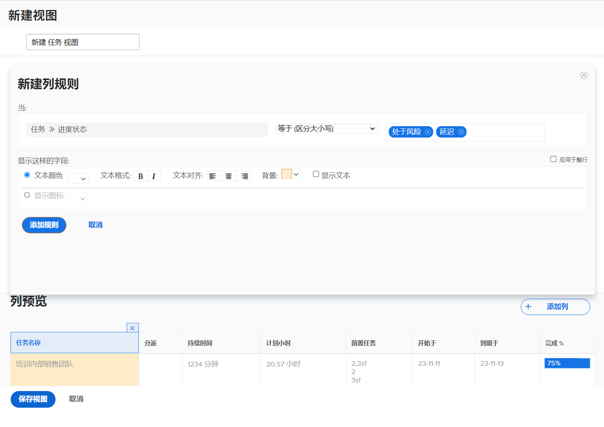

# 向视图添加基本条件格式

条件格式通过创建列规则来完成。 利用列规则，可根据您设置的条件以特定方式设置列的格式。

在此视频中，您将学习：

* 视图中的条件格式
* 如何创建和修改条件格式

>[!VIDEO](https://video.tv.adobe.com/v/335149/?quality=12)

## 活动：向视图添加条件格式

使用现有的标准视图创建名为“标准+进度”的任务视图，并在 [!UICONTROL Name] 列。

1. 添加一个列规则，当任务的进度状态为“延迟”时，该规则会将字段背景变为红色。
1. 添加列规则，当进度状态为“在后面”或“处于风险”时，该规则会将字段背景变为黄色。

这将帮助您发现问题任务，而无需在视图中包含进度状态列。

## 回答

1. 在任务列表报表中，转到 **[!UICONTROL View]** 下拉菜单，然后选择 **[!UICONTROL New View]**.
1. 将视图命名为“Standard + Progress”。
1. 使用提供的默认列。
1. 选择 [!UICONTROL Task Name] 列。 这是您要将条件格式应用到的列，因此如果任务的进度状态不是“开启”，则该列会显示为红色或黄色。
1. 单击 **[!UICONTROL Advanced Options]** 报表生成器窗口的右上角。
1. 单击 **[!UICONTROL Add a Rule for this Column]**.
1. 通过更改 [!UICONTROL Task] > [!UICONTROL Name] 窗口顶部的 [!UICONTROL Task] > [!UICONTROL Progress Status]. 只需单击 **[!UICONTROL X]** 图标 [!UICONTROL Task] > [!UICONTROL Name] 以将其从字段中删除。
1. 在字段中键入“progress”，然后选择 [!UICONTROL Progress Status] 下 [!UICONTROL Task] 字段源。
1. 选择 **[!UICONTROL Late]** 的 [!UICONTROL Equal] 限定符。
1. 在 [!UICONTROL Text Color] 行。
1. 单击 **[!UICONTROL Add Rule]** 来保存列规则。
1. 现在，单击 **[!UICONTROL Add Column Rule]** 再次添加其他规则。
1. 与之前一样，删除 [!UICONTROL Task] > [!UICONTROL Name] 中。 将其替换为 [!UICONTROL Progress Status] 下 [!UICONTROL Task] 字段源。
1. 同时选择 [!UICONTROL At Risk] 和 [!UICONTROL Behind] 在“等于”限定符右侧的字段中。
1. 在 [!UICONTROL Text Color] 行。
1. 单击 **[!UICONTROL Add Rule]** 来保存列规则。
1. 单击 **[!UICONTROL Save View]** 来保存视图。
