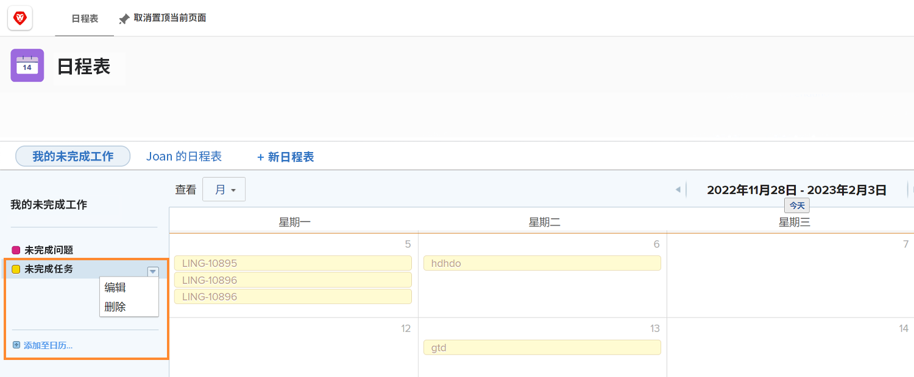

# 了解其他日历选项

在此部分中，您将学习如何：

* 编辑日历分组
* 删除日历分组
* 共享日历

## 编辑日历分组

要编辑分组，请将鼠标悬停在日历上的名称上。 单击右侧显示的向下箭头，然后选择 **[!UICONTROL Edit]**.

## 删除日历分组

要删除分组，请将鼠标悬停在日历上的名称上。 单击右侧显示的向下箭头，然后选择 **[!UICONTROL Delete]**.

## 共享日历

作为项目经理，您可以创建一个要与他人共享的日历，如项目经理、团队成员等。

1. 从 **[!UICONTROL Main Menu]**，选择 **[!UICONTROL Calendars]** 的上界。
1. 选择要共享的日历。
1. 选择 **[!UICONTROL Sharing]** 从 **[!UICONTROL Calendar Actions]** 下拉菜单。
1. 输入要与其共享日历的用户、角色、团队、组或公司的名称。
1. 选择用户是否获得 [!UICONTROL View] 或 [!UICONTROL Manage] 访问日历报表。
1. 单击 **[!UICONTROL Save]**.

在您共享日历时，请注意以下几点：

* 单击 **[!UICONTROL gear icon]** （位于“共享”窗口的右上角）以使日历在系统范围内可见，或将其公开给外部用户。
* [!UICONTROL View] “访问”允许用户查看日历，但不会更改控制分组的过滤器。
* [!UICONTROL Manage] 访问权限允许用户查看日历并更改控制分组的过滤器。

## 可共享链接

您可以与其他人共享日历 [!DNL Workfront] 用户通过专用链接。 这会直接将它们转到 [!DNL Workfront].

您可以从 **[!UICONTROL Calendar Actions]** 菜单，通过选择 **[!UICONTROL Get Shareable Link]**. 从此处，单击 **[!UICONTROL Copy Link]** 按钮，并将URL粘贴到其他人的电子邮件或即时消息中。

![图像 [!UICONTROL Get Shareable Link] 屏幕](assets/calendar-3-1.png)
