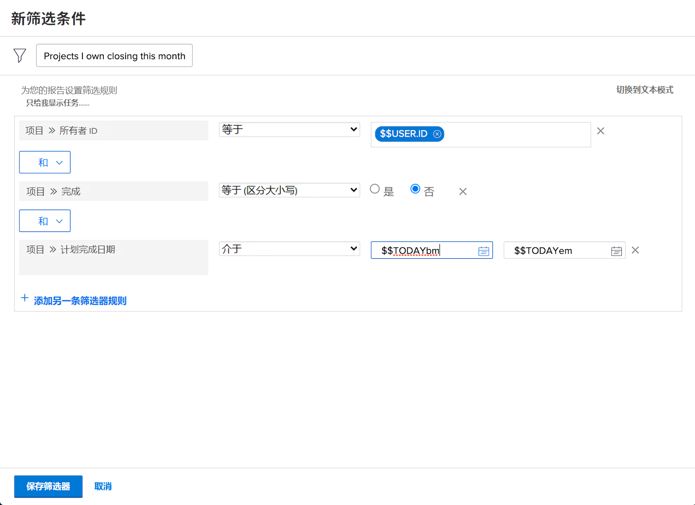

# 创建基本过滤器活动

## 活动1 — 营销组合中的所有项目

在本活动中，您将在以下位置创建一个名为“营销项目组合中的所有项目”的项目过滤器： [!UICONTROL Legacy filter] 体验。 这将向您显示名为“营销Portfolio”的项目组合中的所有项目，而不管其状态如何。

下面包含分步说明。

### 对活动1的答复

1. 从 [!UICONTROL Main Menu] 导航到 [!UICONTROL Projects] 区域。这会向您显示项目列表。
1. 单击 **[!UICONTROL Filter]** 菜单并选择 [!UICONTROL Legacy Filters]
1. 选择 **[!UICONTROL New Filter]**。
1. 将您的过滤器命名为“营销项目组合中的所有项目”。
1. 单击 **[!UICONTROL Add Filter Rule]**。
1. 在 [!UICONTROL Start typing field name] 字段，键入&quot;[!UICONTROL portfolio name]“。 然后在 [!UICONTROL Portfolio] 字段源下选择 [!UICONTROL Name]。
1. 使 [!UICONTROL Equal] 运算符保持原样。
1. Type &quot;[!UICONTROL marketing]中的&quot; [!UICONTROL Start typing name] 字段。
1. 选择 [!UICONTROL Marketing Portfolio] 假设您有一个该名称的项目组合要筛选。 如果不是简单地使用“提前键入”功能来查找所需的项目组合，
1. 单击 **[!UICONTROL Save Filter]**

## 活动2 — 我拥有的项目本月关闭

在本视频中，您将在中创建名为“本月我拥有并关闭的项目”的项目过滤器 [!UICONTROL Legacy filter] 体验。 如果您正在监视许多项目，此过滤器可以帮助您放大计划不久即将关闭的项目。

下面包含分步说明。

>[!VIDEO](https://video.tv.adobe.com/v/336807/?quality=12&learn=on)

### 对活动2的答复

1. 从 [!UICONTROL Main Menu] 导航到 [!UICONTROL Projects] 区域。这会向您显示项目列表。
1. 单击 **[!UICONTROL Filter]** 菜单并选择 [!UICONTROL Legacy Filters]
1. 选择 **[!UICONTROL New Filter]**。
1. 将您的过滤器命名为“本月关闭的我所拥有的项目”。
1. 单击 **[!UICONTROL Add Filter Rule]**。
1. 在 [!UICONTROL Start typing field name] 字段，键入“owner”。 然后在 [!UICONTROL Project] 字段源下选择 [!UICONTROL Owner ID]。
1. 使 [!UICONTROL Equal] 运算符保持原样。
1. 在“$$”中键入 [!UICONTROL Start typing name] 字段。
1. 选择 [!UICONTROL $$USER.ID]。这是登录用户的通配符。
1. 再次单击 [!UICONTROL Add Filter Rule]。
1. 在 [!UICONTROL Start typing field name] 字段中，开始键入“Is Complete”。 然后在项目字段源下选择 [!UICONTROL Is Complete] 。
1. 使 [!UICONTROL Equal] 运算符保持原样。
1. 选择“False”。
1. 再次单击 [!UICONTROL Add Filter Rule]。
1. 在 [!UICONTROL Start typing field name] 字段类型“已计划”，然后选择 [!UICONTROL Planned Completion Date] 在 [!UICONTROL Project] 字段源。
1. 将 [!UICONTROL Equal] 运算符更改为 [!UICONTROL This Month]。
1. 单击 **[!UICONTROL Save Filter]**
