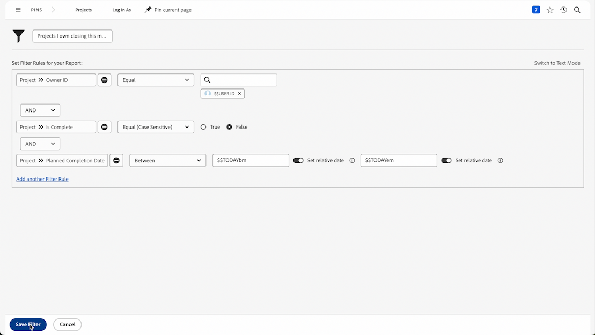

# 创建基本过滤器活动

## 活动 1 - 营销项目组合中的所有项目

在此活动中，您将会在 [!UICONTROL Legacy filter] 体验中创建一个名为“营销项目组合中的所有项目”的项目过滤器。这将会向您显示名为“营销项目组合”的项目组合中的所有项目，无论其状态如何。

下面包含分步说明。

## 活动 1 答案

1. 从 [!UICONTROL Main Menu] 导航到 [!UICONTROL Projects] 区域。这会向您显示项目列表。
1. 单击&#x200B;**[!UICONTROL Filter]**&#x200B;菜单，选择[!UICONTROL Legacy Filters]（如果尚未选择）。
1. 选择 **[!UICONTROL New Filter]**。
1. 将您的过滤器命名为“营销项目组合中的所有项目”。
1. 单击 **[!UICONTROL Add Filter Rule]**。
1. 单击&#x200B;**选择字段**&#x200B;字段并开始键入单词“[!UICONTROL portfolio name]”。 然后在 [!UICONTROL Portfolio] 字段源下选择 [!UICONTROL Name]。
1. 使 [!UICONTROL Equal] 运算符保持原样。
1. 在搜索字段中键入“[!UICONTROL marketing]”。
1. 选择 [!UICONTROL Marketing Portfolio]，假设您有一个要筛选的名称的项目组合。如果没有，只需使用提前输入功能即可找到您想要的项目组合。
1. 单击 **[!UICONTROL Save Filter]**。

## 活动 2 - 我拥有的本月结束的项目

在此视频中，您将会在 [!UICONTROL Legacy filter] 体验中创建一个名为“我拥有的本月结束的项目”的项目过滤器。如果您正在关注大量项目，此过滤器可以帮助您重点关注规划很快关闭的项目。

下面包含分步说明。

>[!VIDEO](https://video.tv.adobe.com/v/336807/?quality=12&learn=on&enablevpops=1)

## 活动 2 答案

1. 从 [!UICONTROL Main Menu] 导航到 [!UICONTROL Projects] 区域。这会向您显示项目列表。
1. 单击&#x200B;**[!UICONTROL Filter]**&#x200B;菜单，选择[!UICONTROL Legacy Filters]（如果尚未选择）。
1. 选择 **[!UICONTROL New Filter]**。
1. 将您的过滤器命名为“我拥有的本月结束的项目”。
1. 单击 **[!UICONTROL Add Filter Rule]**。
1. 单击&#x200B;**选择字段**&#x200B;字段并开始键入“所有者”一词。 现在，单击[!UICONTROL Project]字段源下的所有者ID。
1. 使 [!UICONTROL Equal] 运算符保持原样。
1. 在搜索字段中键入“$$”。
1. 选择 [!UICONTROL $$USER.ID]。这是登录用户的通配符。
1. 单击添加其他筛选规则。
1. 单击&#x200B;**选择字段**&#x200B;字段并开始键入“已完成”一词。 现在，单击[!UICONTROL Project]字段源下的“已完成”。
1. 使 [!UICONTROL Equal] 运算符保持原样。
1. 选择“False”。
1. 再次单击添加其他筛选器规则。
1. 单击&#x200B;**选择字段**&#x200B;字段并开始键入“已计划”一词。 现在单击[!UICONTROL Project]字段源下的“规划完成日期”。
1. 将 [!UICONTROL Equal] 运算符更改为 [!UICONTROL This Month]。
1. 单击 **[!UICONTROL Save Filter]**。
