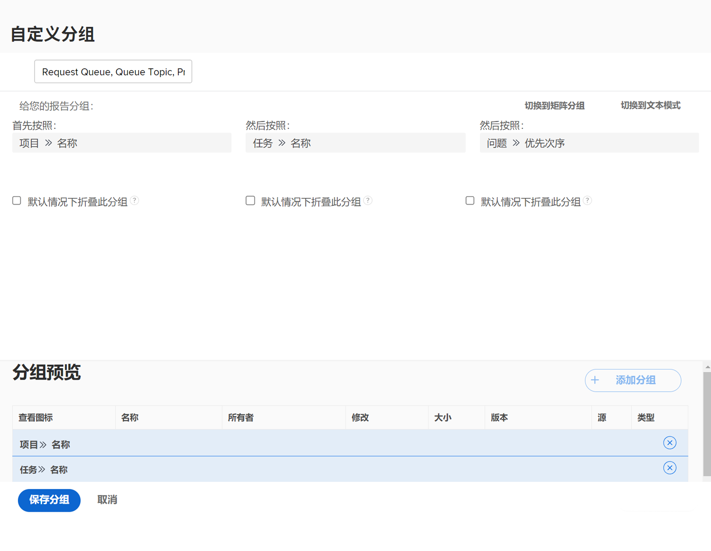

# 创建基本分组

在本视频中，您将了解到：

* Workfront 中的分组是什么
* 如何创建分组
* 以及如何与其他 Workfront 用户共享分组

>[!VIDEO](https://video.tv.adobe.com/v/335147/?quality=12&learn=on)

## 创建基本的分组活动

[单击此处](/help/assets/create-basic-grouping-activities.pdf)下载此页面的 PDF。

### 活动 1：创建一个基本分组

创建将在报告中使用的问题分组，以跟踪通过请求队列发出的请求。通过这种分组，可以轻松查看按优先级分组的类似类型的问题/请求。将分组命名为“请求队列、队列主题、优先级”。

根据以下条件对问题报告进行分组：

1. 请求队列的名称（这将会是项目名称）
1. 队列主题
1. 请求的优先级

### 答案 1

1. 在问题列表报告中，转至 **[!UICONTROL Grouping]** 菜单并选择 **[!UICONTROL New Grouping]**。
1. 将您的分组命名为“请求队列、队列主题、优先级”。
1. 单击 **[!UICONTROL Add Grouping]**。
1. 在 [!UICONTROL First By] 字段。输入“项目名称”，然后在项目字段源下选择 **[!UICONTROL Name]**。
1. 单击 **[!UICONTROL Add another Grouping]**。
1. 在 [!UICONTROL And then by] 字段中，输入“队列”，然后选择 [!UICONTROL Queue Topic] 字段源下的 **[!UICONTROL Name]**。
1. 单击 **[!UICONTROL Add another Grouping]**。
1. 在 [!UICONTROL And then by] 字段中，输入“优先级”，然后选择 [!UICONTROL Issue] 字段源下的 **[!UICONTROL Priority]**。
1. 单击 **[!UICONTROL Save Grouping]**
