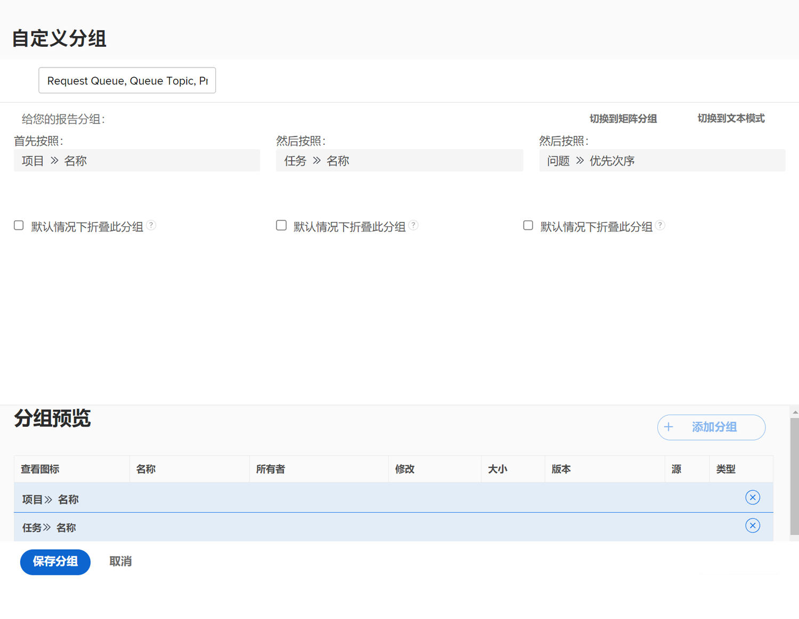

# 创建基本分组

此视频介绍如何在Workfront中创建和管理分组，以有效组织项目列表。 分组&#x200B;与过滤器和视图一起是三个主要报表元素之一，它们有助于根据共享信息整理结果。  
本教程提供了组织项目列表以简化日常工作和协作的实际步骤。  

>[!VIDEO](https://video.tv.adobe.com/v/3449825/?captions=chi_hans&quality=12&learn=on&enablevpops=0)

## 关键要点

* **分组的用途：**&#x200B;分组是Workfront中的一个关键报表元素，用于根据共享信息（如完成日期、项目组合或项目群）组织项目列表。  
* **创建分组：**&#x200B;您最多可以使用三个级别的条件创建自定义分组。 例&#x200B;如，项目可以首先按项目组合分组，然后按项目群分组，以改善组织效果。  
* **无法覆盖编辑和保存分组：**&#x200B;内置分组，但您可以将编辑内容另存为新分组。 自&#x200B;定义分组应该具有清晰的描述性名称，以便轻松识别。  
* **共享分组：**&#x200B;分组可以与其他用户共享，具有默认的“查看”权限，允许他们使用和共享分组，但不能编辑它。 “&#x200B;管理”权限允许编辑和删除。  
* **删除分组：**&#x200B;删除您创建的分组也会从与其共享该分组的用户列表中将其删除。 共享&#x200B;的分组显示在其他用户的“与我共享”部分下。  

## “创建基本分组”活动

### 活动 1：创建一个基本分组

创建将在报告中使用的问题分组，以跟踪通过请求队列发出的请求。 通过这种分组，可以轻松查看按优先级分组的类似类型的问题/请求。 将分组命名为“请求队列、队列主题、优先级”。

根据以下条件对问题报告进行分组：

1. 请求队列的名称（这将会是项目名称）
1. 队列主题
1. 请求的优先级

### 答案 1

1. 在问题列表报告中，转至 **[!UICONTROL Grouping]** 菜单并选择 **[!UICONTROL New Grouping]**。
1. 将您的分组命名为“请求队列、队列主题、优先级”。
1. 单击 **[!UICONTROL Add Grouping]**。
1. 在 [!UICONTROL Group by] 字段。 输入“项目名称”，然后在项目字段源下选择 **[!UICONTROL Name]**。
1. 单击&#x200B;**[!UICONTROL Add another Grouping]**，然后键入“queue”并选择[!UICONTROL Queue Topic]字段源下的&#x200B;**[!UICONTROL Name]**。
1. 单击&#x200B;**[!UICONTROL Add another Grouping]**，然后键入“priority”并选择[!UICONTROL Issue]字段源下的&#x200B;**[!UICONTROL Priority]**。
1. 单击 **[!UICONTROL Save Grouping]**
