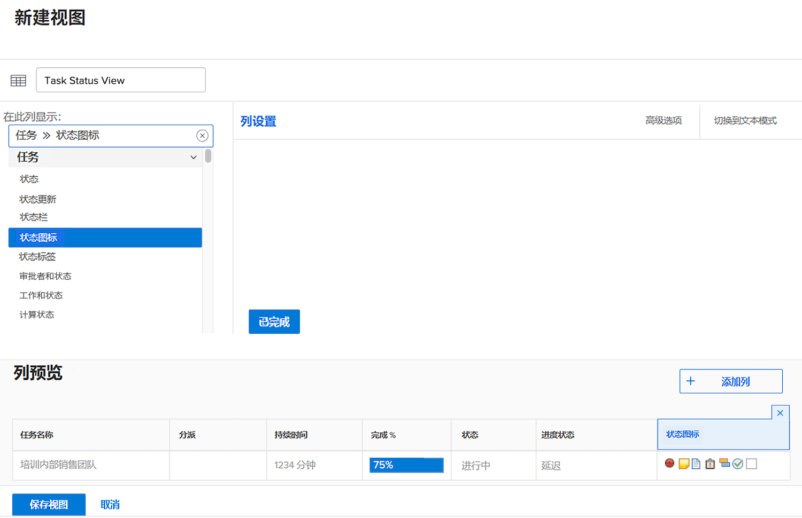
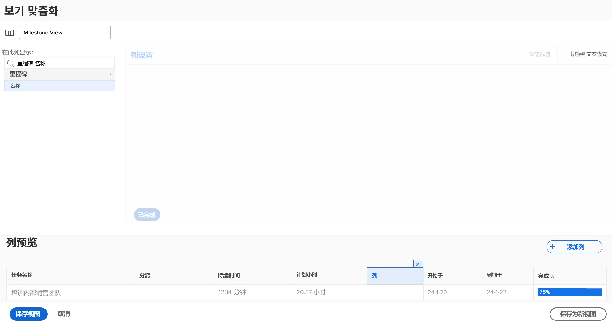
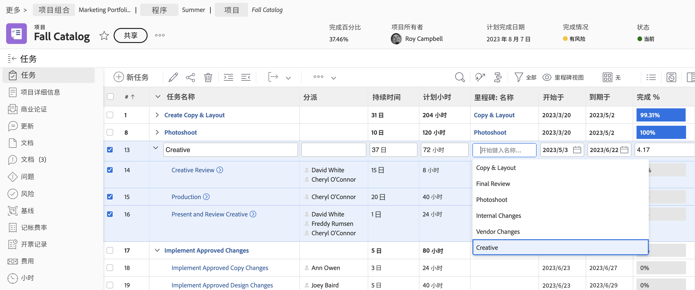
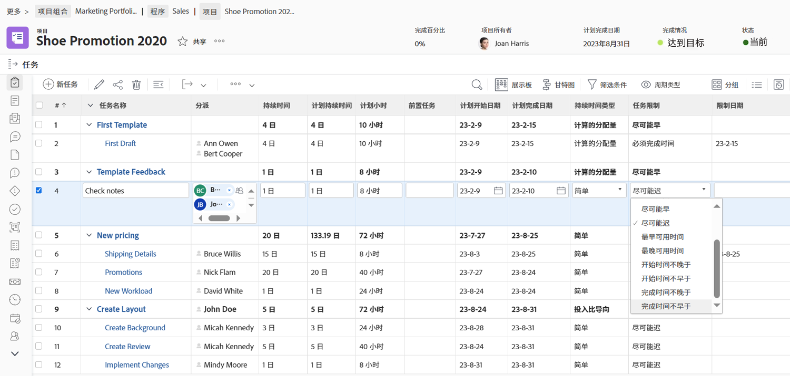
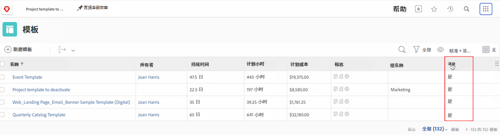

# 创建基本视图

在本视频中，您将了解到：

* Workfront 中的视图是什么
* 如何创建和修改视图
* 如何与其他 Workfront 用户共享视图

>[!VIDEO](https://video.tv.adobe.com/v/335148/?quality=12&learn=on)

## 活动 1：创建任务状态视图

作为项目经理、团队领导或资源管理者，您希望跟踪任务工作的进展情况。通过此视图，您可以在列表或报告的一行中获得任务的多个状态指标。

创建一个名为“任务状态视图”的任务视图，其中包含以下各列：

* [!UICONTROL Task Name]
* [!UICONTROL Assignments]
* [!UICONTROL Duration]
* [!UICONTROL Percent Complete]
* [!UICONTROL Status]
* [!UICONTROL Progress Status]
* [!UICONTROL Status Icons]

## 活动 1 答案

1. 在任务列表报告中，转至 **[!UICONTROL View]** 下拉菜单并选择 **[!UICONTROL New View]**。
1. 将您的视图命名为“任务状态视图”。
1. 删除这些列：[!UICONTROL Pln Hrs]、[!UICONTROL Predecessors]、[!UICONTROL Start On] 和 [!UICONTROL Due On]。
1. 单击 **[!UICONTROL Add Column]**。
1. 在 [!UICONTROL Show in this column] 字段中，输入“状态”，然后选择 [!UICONTROL Task] 字段源下的“状态”。
1. 再次单击 **[!UICONTROL Add Column]**。
1. 在 [!UICONTROL Show in this column] 字段中，输入“状态”，然后选择 [!UICONTROL Task] 字段源下的“进度状态”。
1. 再次单击 **[!UICONTROL Add Column]**。
1. 在 [!UICONTROL Show in this column] 字段中，键入“状态”，然后选择任务字段源下的“状态图标”。
1. 单击 **[!UICONTROL Save]**。

将鼠标悬停在 [!UICONTROL Status Icons] 列中的每个图标上，查看它们所代表的内容。如果它们呈灰色，则意味着该任务没有注释、文档、审批流程等。如果图标以彩色显示，则至少有一个项目与该任务关联。您可以单击注释或文档图标以转到该项目。

## 活动 2：创建里程碑视图

如果您使用里程碑，此视图是按名称查看里程碑并使用内联编辑添加或编辑它们的最简单方法。

创建一个名为“里程碑视图”的任务视图，其中包含以下各列：

* [!UICONTROL Task Name]
* [!UICONTROL Assignments]
* [!UICONTROL Duration]
* [!UICONTROL Pln Hrs]
* [!UICONTROL Milestone: Name]
* [!UICONTROL Start On]
* [!UICONTROL Due On]
* [!UICONTROL Percent Complete]

## 活动 2 答案

1. 在项目任务列表中，转至 **[!UICONTROL View]** 下拉菜单并选择 **[!UICONTROL New View]**。
1. 将您的视图命名为“里程碑视图”。
1. 单击 [!UICONTROL Predecessors] 列来选择它。
1. 在 [!UICONTROL Show in this column] 字段中，单击 [!UICONTROL Task >> Predecessors] 字段中的 X 图标，然后输入“[!UICONTROL milestone name]”并单击列表中的“[!UICONTROL Name]”。
1. 单击 **[!UICONTROL Save]**。

## 活动 3：创建持续时间类型和任务限制视图

此视图将允许您检查和编辑项目中的所有持续时间类型和任务限制。

创建一个名为“持续时间类型和任务限制视图”的任务视图，其中包含以下各列：

* [!UICONTROL Task Name]
* [!UICONTROL Assignments]
* [!UICONTROL Duration]
* [!UICONTROL Planned Duration]
* [!UICONTROL Pln Hrs]
* [!UICONTROL Predecessors]
* [!UICONTROL Start On]
* [!UICONTROL Due On]
* [!UICONTROL Duration Type]
* [!UICONTROL Task Constraint]
* [!UICONTROL Constraint Date]

更改 [!UICONTROL Start On] 和 [!UICONTROL Due On] 列上的 [!UICONTROL Field Format] 以显示日期和时间。

## 活动 3 答案

1. 在项目任务列表中，转至 **[!UICONTROL View]** 下拉菜单并选择 **[!UICONTROL New View]**。
1. 将您的视图命名为“持续时间类型和任务限制视图”。
1. 删除 [!UICONTROL % Complete] 列。
1. 单击 **[!UICONTROL Add Column]**。
1. 在 [!UICONTROL Show in this column] 字段中，输入 [!UICONTROL "duration"]，然后选择 [!UICONTROL Task] 字段源下的 [!UICONTROL "Planned Duration"]。
1. 将此列移至 [!UICONTROL Duration] 和 [!UICONTROL Pln Hrs] 列之间。
1. 再次单击 **[!UICONTROL Add Column]**。
1. 在 [!UICONTROL Show in this column] 字段中，输入 [!UICONTROL "duration type"]，然后选择 [!UICONTROL Task] 字段源下的 [!UICONTROL "Duration Type"]。
1. 再次单击 **[!UICONTROL Add Column]**。
1. 在 [!UICONTROL Show in this column] 字段中，输入 [!UICONTROL "constraint"]，然后选择任务字段源下的 [!UICONTROL "Task Constraint"]。
1. 再次单击 **[!UICONTROL Add Column]**。
1. 在 [!UICONTROL Show in this column] 字段中，输入 [!UICONTROL "constraint"]，然后选择任务字段源下的 [!UICONTROL "Constraint Date"]。
1. 选择 [!UICONTROL Start On] 列，然后单击 [!UICONTROL Advanced Options]。
1. 在 [!UICONTROL Field Format] 下拉菜单下，选择 [!UICONTROL "10/17/60 3:00 AM"]。
1. 选择 [!UICONTROL Due On] 列，然后单击 [!UICONTROL Advanced Options]。
1. 在 [!UICONTROL Field Format] 下拉菜单下，选择 [!UICONTROL "10/17/60 3:00 AM"]。
1. 单击 **[!UICONTROL Save]**。

## 活动 4：创建项目模板活动状态视图

管理项目模板的任何人都会喜欢看到列表中每个模板的活动状态（True 或 False）。更理想的情况是 - 该字段是内联可编辑的！

创建一个名为“标准+活动状态”的项目模板视图，其中包含以下列：

* [!UICONTROL Name]
* [!UICONTROL Owner]
* [!UICONTROL Duration]
* [!UICONTROL Planned Hours]
* [!UICONTROL Planned Cost]
* [!UICONTROL Flags]
* [!UICONTROL Group Name]
* [!UICONTROL Is Active]

## 活动 4 答案

1. 在项目模板列表中，转至 **[!UICONTROL View]** 下拉菜单并选择 **[!UICONTROL New View]**。
1. 将您的视图命名为“标准+活动状态。
1. 单击 **[!UICONTROL Add Column]**。
1. 在 [!UICONTROL Show in this column] 字段中，输入“是”，然后选择 [!UICONTROL Template] 字段源下的“活动状态”。
1. 单击 **[!UICONTROL Save View]**。
