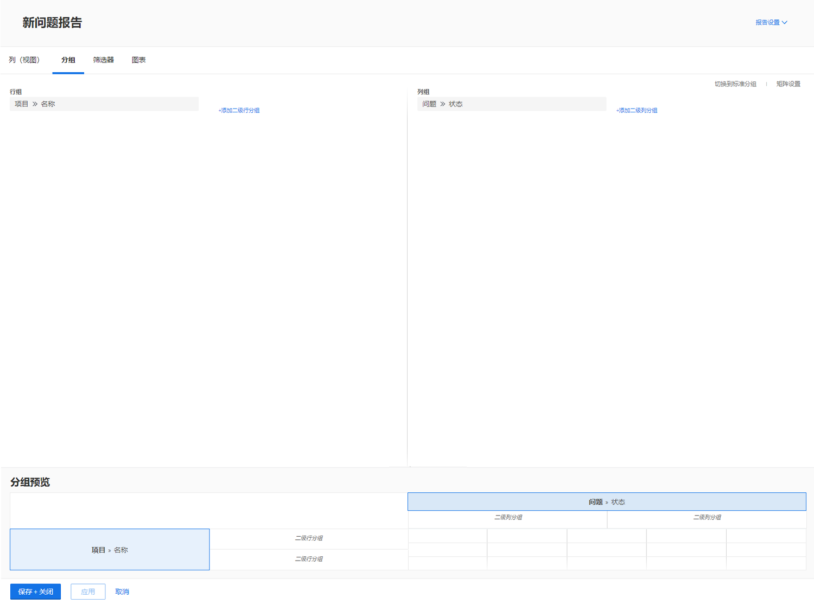
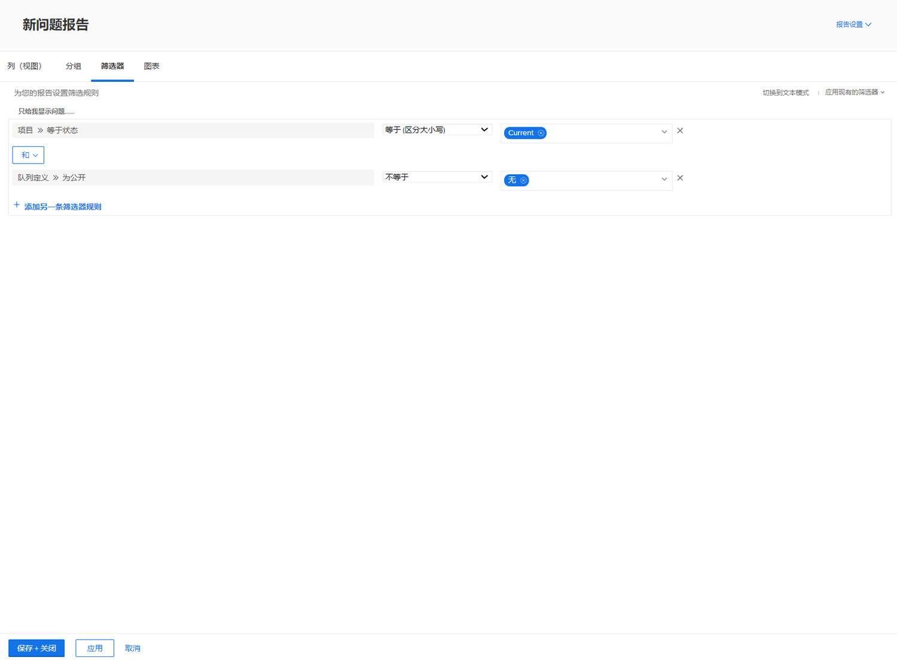

# 创建矩阵报表

在此视频中，您将学习：

* 矩阵报表何时可用
* 以及如何创建矩阵报表

>[!VIDEO](https://video.tv.adobe.com/v/335156/?quality=12)

## 活动：创建矩阵报表

创建一个矩阵报表，以显示每个状态中有多少个请求，按请求队列排序。 这可以让您快速了解工作量，以及您与之保持的同步程度。

您希望请求队列显示在行分组中。 状态显示为列分组。 将报表命名为“按状态和请求队列的请求”。

## 回答

1. 选择 **[!UICONTROL Reports]** 从 **[!UICONTROL Main Menu]**.
1. 单击 **[!UICONTROL New Report]** 选项和选择 **[!UICONTROL Issue]**.
1. 转到 **[!UICONTROL Groupings]** 选项卡，单击 **[!UICONTROL Switch to Matrix Grouping]**.
1. 对于 [!UICONTROL Row Groupings]，选择 **[!UICONTROL Project]** > **[!UICONTROL Name]**.
1. 对于 [!UICONTROL Column Grouping]，选择 **[!UICONTROL Issue]** > **[!UICONTROL Status]**.

   

1. 转到 **[!UICONTROL Filters]** 选项卡。
1. 要确保在活动请求队列中只看到请求，请添加以下过滤器规则：

   * [!UICONTROL Project] > [!UICONTROL Status Equates With] > [!UICONTROL Equal] > [!UICONTROL Current]
   * [!UICONTROL Queue Definition] > [!UICONTROL Is Public] > [!UICONTROL Not Equal] > [!UICONTROL None] （这就是我们如何通过将队列定义分配给其中一个公共选项来知道项目实际上是请求队列。）

1. 单击 **[!UICONTROL Save + Close]**. 在提示输入报表名称时，键入“按状态和请求队列的请求”。

   
