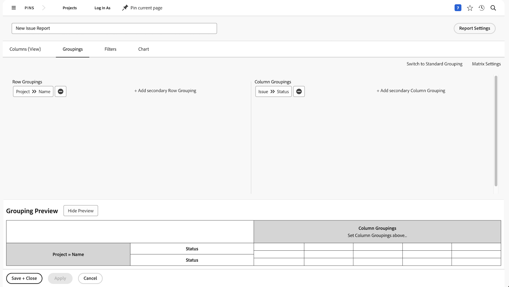
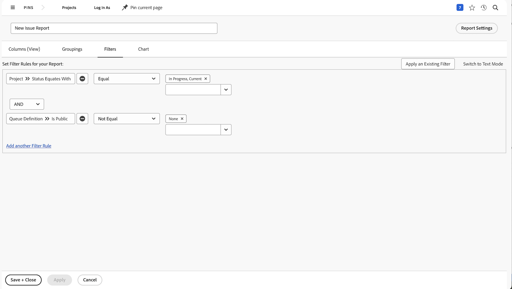

# 创建矩阵报告

在本视频中，您将了解到：

* 矩阵报告何时有用
* 以及如何创建矩阵报告

>[!VIDEO](https://video.tv.adobe.com/v/3448193/?captions=chi_hans&quality=12&learn=on&enablevpops=0)

## 关键要点

* **Matrix报表结构：** Matrix报表按行和列组织数据，并自动汇总行和列。 它&#x200B;们非常适合于跟踪工作时间、成本和收入等指标。  
* **筛选器设置：**&#x200B;使用筛选器关注特定数据，例如特定主团队的用户在上一季度工作的小时数。 “所有者&#x200B;字段源”可帮助识别相关团队成员。  
* **分组选项：**&#x200B;在我们的示例中，行按“所有者名称”（工作小时的人员）分组，而列按“小时输入日期”（按月和周）分组。  
* **汇总数据：**&#x200B;默认情况下汇总小时数、实际成本和收入等列，确保在矩阵中显示总计。 如果需要，可以关闭这些默认值。  
* **图表集成：**&#x200B;矩阵报表可以使用用于替代数据可视化的图表来补充，并使用相同的分组信息。 可以将矩阵选项卡或图表选项卡设置为默认视图。  

## “创建矩阵式报告”活动

### 活动 1：创建矩阵报告

创建一个矩阵报告，其中显示每个状态中有多少请求，并按请求队列排序。 这可以让您快速了解即将到来的工作量以及您的工作进度。

建议在行分组上显示请求队列。 状态显示为列分组。 将您的报告命名为“按状态和请求队列列出的请求”。

### 答案 1

1. 从 **[!UICONTROL Main Menu]** 中选择 **[!UICONTROL Reports]**。
1. 单击 **[!UICONTROL New Report]** 选项，并选择 **[!UICONTROL Issue]**。
1. 转到 **[!UICONTROL Groupings]** 选项卡，并单击 **[!UICONTROL Switch to Matrix Grouping]**。
1. 对于 [!UICONTROL Row Groupings]，选择 **[!UICONTROL Project]** > **[!UICONTROL Name]**。
1. 对于 [!UICONTROL Column Grouping]，选择 **[!UICONTROL Issue]** > **[!UICONTROL Status]**。

   

1. 转到 **[!UICONTROL Filters]** 选项卡。
1. 为了确保您只会看到活跃的请求队列中的请求，请添加以下过滤规则：

   * [!UICONTROL Project] > [!UICONTROL Status Equates With] > [!UICONTROL Equal] > [!UICONTROL Current]
   * [!UICONTROL Queue Definition] > [!UICONTROL Is Public] > [!UICONTROL Not Equal] > [!UICONTROL None]（这就是我们通过将“队列定义”分配给一个公共选项来知道某个项目实际上是一个请求队列的方式。）

1. 单击 **[!UICONTROL Save + Close]**。 当系统提示输入报告名称时，键入“按状态和请求队列列出的请求”。

   
