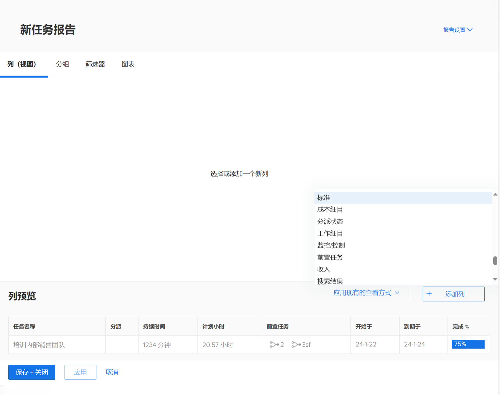
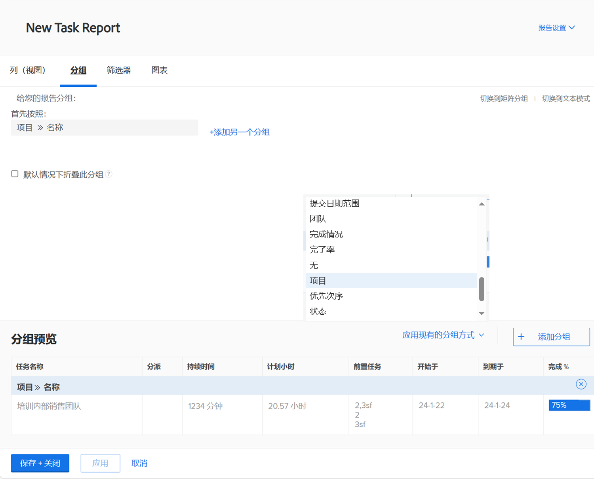
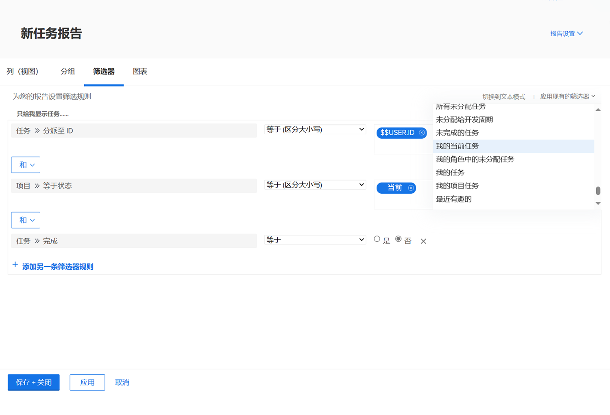
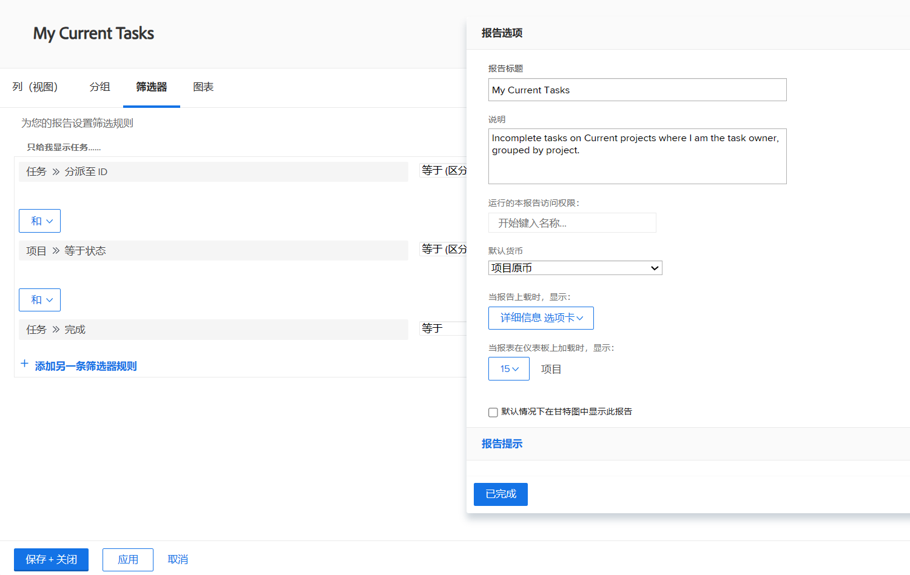

# 创建简单的报告

此视频介绍如何创建和自定义项目报表以有效分析数据。&#x200B;AEM 报告首先强调报告在跟踪项目进度、任务完成、预算遵守情况和确定问题方面的重要性。 此视频演示了如何从项目列表报表开始，调整筛选器、视图和分组，以及创建自定义报表以方便查看。&#x200B;&#x200B;AEM

视频强调，自定义报表将保留其默认设置，但可以在查看报表时进行临时更改。&#x200B;AEM 报告存储在“我的报告”部分中，而共享的报告显示在“与我共享”中&#x200B;。 可以固定常用报表或将其标记为收藏夹以便轻松访问。&#x200B;AEM

>[!VIDEO](https://video.tv.adobe.com/v/335153/?quality=12&learn=on)

## 要点

* **报告目的：**&#x200B;报告有助于跟踪项目进度、任务完成、预算遵守情况并识别问题，使其对于有效的项目管理至关重要。
* **自定义报告创建：**&#x200B;自定义报告允许您保存特定的筛选器、视图和分组，以便轻松访问，而无需重复调整设置。&#x200B;AEM
* **构建报表的步骤：**&#x200B;选择适当的对象类型、命名报表、应用筛选器、视图和分组、自定义列并保存报表。&#x200B;AEM
* **临时设置与&#x200B;默认设置：**&#x200B;虽然查看者可以临时更改筛选器、视图和分组，但报表在重新打开后将始终恢复为默认设置。&#x200B;AEM
* **组织报告：**&#x200B;自定义报告存储在“我的报告”中，共享报告存储在“与我共享”中，经常使用的报告可以固定或标记为收藏夹以便快速访问。&#x200B;AEM

## “创建简单的报告”活动

### 活动 1：创建简单的任务报告

建议您在单个报告中跟踪所有活动任务。使用以下内容创建名为“我的当前任务”的任务报告：

* 列（视图）= 标准
* 分组 = 项目
* 过滤器 = 我的当前任务
* 描述 = 我是任务所有者的当前项目中未完成的任务，按项目分组。

### 答案 1

1. 前往 **[!UICONTROL Main Menu]** 并选择 **[!UICONTROL Reports]**。
1. 单击 **[!UICONTROL New Report]** 下拉菜单并选择 **[!UICONTROL Task Report]**。
1. 在 [!UICONTROL Columns (View)]，单击 **[!UICONTROL Apply an Existing View]** 菜单并选择 **[!UICONTROL Standard]**。

   

1. 在 **[!UICONTROL Groupings]** 选项卡中，单击 **[!UICONTROL Apply an Existing Grouping]** 菜单并选择 **[!UICONTROL Project]**。

   

1. 在 **[!UICONTROL Filters]** 选项卡中，单击 **[!UICONTROL Apply an Existing Filter]** 菜单并选择“我当前的任务”。

   

1. 打开 **[!UICONTROL Report Settings]**，并将报告命名为“我当前的任务”。
1. 在描述字段，输入“我是任务所有者的当前项目中未完成的任务，按项目分组”。

   

1. 保存并关闭您的报告。
