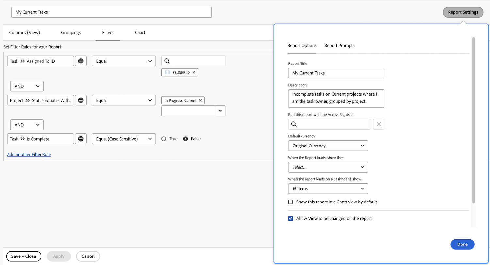

# 创建简单报表

在本视频中，您将了解如何：

* 使用现有筛选器、视图和分组创建简单报表

>[!VIDEO](https://video.tv.adobe.com/v/335153/?quality=12)

## 活动：创建简单的任务报告

要在单个报表中跟踪所有活动任务。 使用以下方式创建一个名为“我的当前任务”的任务报告：

* 列（视图） =标准
* 分组=项目
* 筛选器=我的当前任务
* 描述=我作为任务负责人的当前项目中的未完成任务（按项目分组）。

## 答案

1. 转到 **[!UICONTROL Main Menu]** 并选择 **[!UICONTROL Reports]**.
1. 单击 **[!UICONTROL New Report]** 下拉菜单并选择 **[!UICONTROL Task Report]**.
1. In [!UICONTROL Columns (View)]，单击 **[!UICONTROL Apply an Existing View]** 菜单并选择 **[!UICONTROL Standard]**.

   

1. 在 **[!UICONTROL Groupings]** 选项卡，单击 **[!UICONTROL Apply an Existing Grouping]** 菜单并选择 **[!UICONTROL Project]**.

   

1. 在 **[!UICONTROL Filters]** 选项卡，单击 **[!UICONTROL Apply an Existing Filter]** 菜单，然后选择我的当前任务。

   

1. 打开 **[!UICONTROL Report Settings]** 并将报表命名为“我的当前任务”。
1. 在“描述”字段中，输入“我作为任务负责人的当前项目中的未完成任务，按项目分组”。

   

1. 保存并关闭报告。
