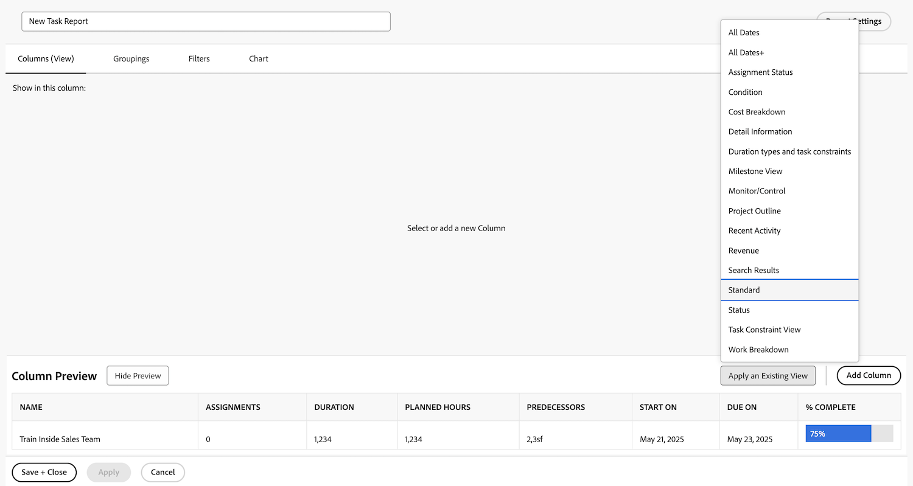

# 创建简单的报告

在本视频中，您将学习如何：

* 使用现有的过滤器、视图和分组创建简单的报告

>[!VIDEO](https://video.tv.adobe.com/v/335153/?quality=12&learn=on)

## “创建简单报表”活动

### 活动 1：创建简单的任务报告

建议您在单个报告中跟踪所有活动任务。使用以下内容创建名为“我的当前任务”的任务报告：

* 列（视图）= 标准
* 分组 = 项目
* 过滤器 = 我的当前任务
* 描述 = 我是任务所有者的当前项目中未完成的任务，按项目分组。

### 答案 1

1. 前往 **[!UICONTROL Main Menu]** 并选择 **[!UICONTROL Reports]**。
1. 单击 **[!UICONTROL New Report]** 下拉菜单并选择 **[!UICONTROL Task Report]**。
1. 在 [!UICONTROL Columns (View)]，单击 **[!UICONTROL Apply an Existing View]** 菜单并选择 **[!UICONTROL Standard]**。

   

1. 在 **[!UICONTROL Groupings]** 选项卡中，单击 **[!UICONTROL Apply an Existing Grouping]** 菜单并选择 **[!UICONTROL Project]**。

   

1. 在 **[!UICONTROL Filters]** 选项卡中，单击 **[!UICONTROL Apply an Existing Filter]** 菜单并选择“我当前的任务”。

   

1. 打开 **[!UICONTROL Report Settings]**，并将报告命名为“我当前的任务”。
1. 在描述字段，输入“我是任务所有者的当前项目中未完成的任务，按项目分组”。

   

1. 保存并关闭您的报告。
