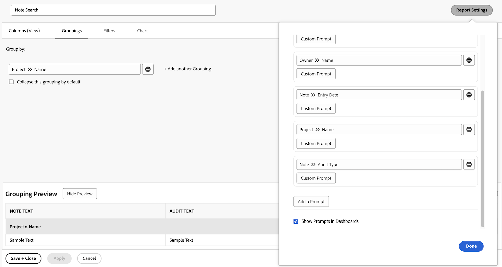

# 单击任务报告

在本视频中，您将了解到：

* 如何使用复杂的过滤器创建任务报告
* 如何查找您创建的报告

>[!VIDEO](https://video.tv.adobe.com/v/335154/?quality=12&learn=on)

>[!TIP]
>
>拿出你的铲子和搅拌碗，准备试试我们的菜谱 [Adobe Workfront Customer Reporting指南](/help/assets/workfront-customer-reporting-cookbook.pdf). 在里面，您可以找到有关10个报表的分步说明，以便您立即在环境中快速启动。
> 
>我们收集了客户最喜欢的报告，并将它们放进一个可快餐、易于理解的指南中，供您收回并在自己的Workfront厨房中测试。
> 
>这10个报表来自与您相同的客户。 我们遍布各行各业、各个部门、各个团队、各个职位，我们衷心感谢那些出色的客户，他们分享了他们最喜欢的报告之一。 有些报表非常简单（但极其有用），有些则更加复杂，无法让您的报表更上一层楼。

## 活动1：创建带有提示的注释报告

创建一份“注释”报告，该报告可用于根据注释内容、作者、输入日期、项目名称或审核类型搜索用户注释（即评论或更新）或系统注释。将报表命名为“注释搜索”。

使用“注释文本”提示时，此报告将会在更新跟帖中进行搜索，以快速提取满足提示中指定条件的任何内容。运行报告时，您无需填写每个提示，只需填写您关心的提示。 空白的提示将会被自动忽略。

该视图应包含以下列：

* 注释文本
* 审核文本
* 输入日期
* 所有者：名称
* 审核类型
* 任务名称
* 问题名称

将过滤器选项卡留空。

根据项目名称分组。

包括以下提示：

* 审核文本
* 注释文本
* 所有者名称
* 输入日期
* 项目名称
* 审核类型

## 活动 1 答案

1. 从 **[!UICONTROL Main Menu]** 中选择 **[!UICONTROL Reports]**。
1. 单击 **[!UICONTROL New Report]** 菜单并选择 **[!UICONTROL Note]**。
1. 在 **[!UICONTROL Columns (View)]** 中，将您的列设置为包括：

   

   * [!UICONTROL Note] > [!UICONTROL Note Text]
   * [!UICONTROL Note] > [!UICONTROL Audit Text]
   * [!UICONTROL Note] > [!UICONTROL Entry Date]
   * [!UICONTROL Owner] > [!UICONTROL Name]
   * [!UICONTROL Note] > [!UICONTROL Audit Type]
   * [!UICONTROL Task] > [!UICONTROL Name]
   * [!UICONTROL Issue] > [!UICONTROL Name]

1. 选择 **[!UICONTROL Entry Date]** 列，并更改 **[!UICONTROL Sort to Descending]**。
1. 在 **[!UICONTROL Groupings]** 选项卡中，将报告设置为根据 [!UICONTROL Project] > [!UICONTROL Name] 分组。

   

1. 将 [!UICONTROL Filters] 留空。
1. 打开 **[!UICONTROL Report Settings]** 并将报表命名为“注释搜索”。
1. 在 [!UICONTROL Description] 字段，输入诸如“Search for System or User notes based on the Audit Type selected（根据选定的审核类型搜索系统或用户注释）”之类的内容。 “系统注释显示在‘审核文本’列中，用户注释显示在‘注释文本’列中。”

   

1. 选择 **[!UICONTROL Details Tab]**，以便在加载报告时显示它。
1. 当在仪表板中加入报告时，将报告设置为显示 200 个项目。
1. 单击 **[!UICONTROL Report Prompts]** 并添加：

   

   * [!UICONTROL Note] > [!UICONTROL Audit Text]
   * [!UICONTROL Note] > [!UICONTROL Note Text]
   * [!UICONTROL Owner] > [!UICONTROL Name]
   * [!UICONTROL Note] > [!UICONTROL Entry Date]
   * [!UICONTROL Project] > [!UICONTROL Name]
   * [!UICONTROL Note] > [!UICONTROL Audit Type]

1. 选中 **[!UICONTROL Show Prompts in Dashboards]** 框。
1. 保存并关闭您的报告。

## 活动2：创建管理员团队反馈报告

这是一个问题报告，显示的是为系统管理员创建的反馈请求队列中的所有问题。 您可以在以下位置了解如何创建此请求队列： [创建系统管理员反馈请求队列](https://experienceleague.adobe.com/docs/workfront-learn/tutorials-workfront/manage-work/request-queues/create-a-system-admin-feedback-request-queue.html) 教程。

此报表还使用自定义表单。 要了解如何创建自定义表单，请参阅 [创建和共享自定义表单](https://experienceleague.adobe.com/docs/workfront-learn/tutorials-workfront/custom-data/custom-forms/custom-forms-creating-and-sharing-a-custom-form.html) 教程。

应按如下方式创建此自定义表单：

名称：管理员进程反馈

1. 流程类型（下拉字段）
   * 访问级别
   * 审批流程（仅限全局）
   * 电子邮件通知
   * 布局模板
   * 里程碑路径
   * 项目模板
   * 提醒通知
   * 请求队列
1. 进程名称（单行文本字段）
1. 流程等级（下拉字段）
   * 1 — 完全没用
   * 2 — 不太有用
   * 3 — 好，但可能更好
   * 4 — 优秀
1. 问题或好消息（段落文本字段）

创建名为的问题报告 **管理员团队反馈报告**.

视图应具有以下列：

* 问题：名称
* 主要联系人：姓名
* 问题：流程类型
* 问题：进程名称
* 问题：流程等级
* 问题：问题或好消息
* 问题：输入日期
* 问题：年龄
* 问题：工作
* 问题：状态

按进程类型分组。

筛选反馈问题所在的请求队列项目的ID。

## 活动 2 答案

1. 从 **[!UICONTROL Main Menu]** 中选择 **[!UICONTROL Reports]**。
1. 单击 **[!UICONTROL New Report]** 菜单并选择 **[!UICONTROL Issue]**。
1. 在 **[!UICONTROL Columns (View)]** 中，将您的列设置为包括：

   

   * [!UICONTROL Issue] > [!UICONTROL Name]
   * [!UICONTROL Primary Contact] > [!UICONTROL Name]
      * 注意：这将以“所有者：名称”作为列标签显示。 您可以通过单击高级选项并在中键入“报告者”，将此项更改为“报告者” **自定义列标签** 字段。
   * [!UICONTROL Issue] > [!UICONTROL Process type]
   * [!UICONTROL Issue] > [!UICONTROL Process name]
   * [!UICONTROL Issue] > [!UICONTROL Process grade]
   * [!UICONTROL Issue] > [!UICONTROL Problem or good news]
   * [!UICONTROL Issue] > [!UICONTROL Entry date]
   * [!UICONTROL Issue] > [!UICONTROL Age]
   * [!UICONTROL Issue] > [!UICONTROL Assignments]
   * [!UICONTROL Issue] > [!UICONTROL Status]

1. 选择 **[!UICONTROL Entry Date]** 列，并更改 **[!UICONTROL Sort to Descending]**。
1. 在 **[!UICONTROL Groupings]** 选项卡中，将报告设置为根据 **[!UICONTROL Issue]>[!UICONTROL Process type]** 分组。

   

1. 在 **[!UICONTROL Filters]** 选项卡，为添加筛选器 **[!UICONTROL Issue]>[!UICONTROL Project ID]** 等于反馈问题所在的请求队列项目。

   

1. 保存并关闭您的报告。
