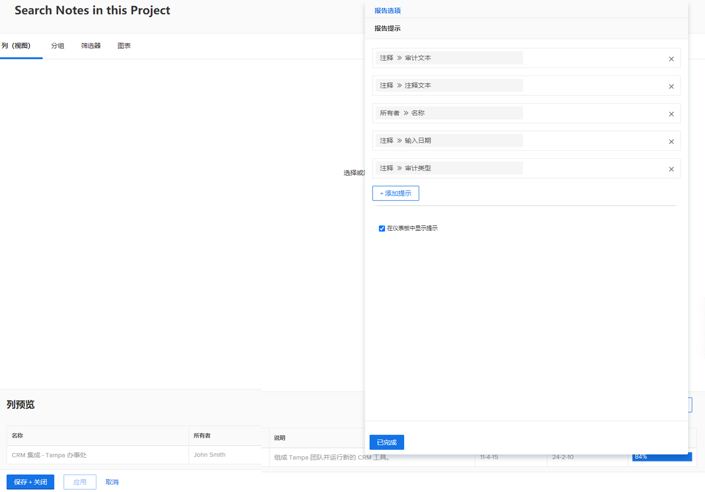
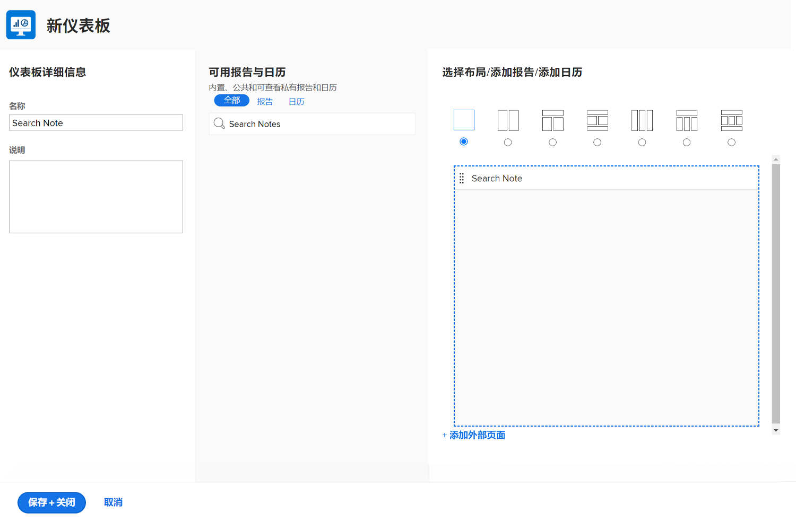
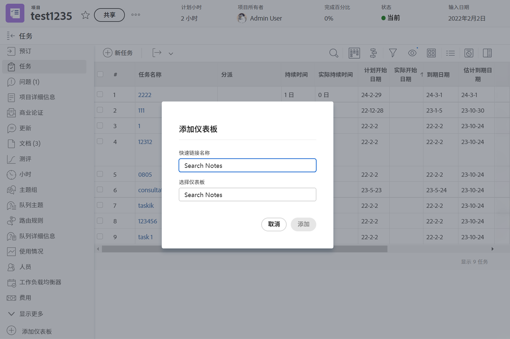

# 创建仪表板

此视频提供了全面指南，让您了解并使用Workfront中的功能板。
&#x200B;AEM它解释说，功能板是报表的集合，允许用户在一个位置组织和显示相关数据。

>[!VIDEO](https://video.tv.adobe.com/v/335157/?quality=12&learn=on)

## 要点

* **Workfront中的仪表板：**&#x200B;仪表板是报表的集合，允许用户在一个集中式视图中组织和显示相关数据，如项目、任务和问题。&#x200B;AEM
* **创建仪表板：**&#x200B;可以通过选择布局、添加报告、自定义日历或外部页面以及排列它们以获得最佳显示来自定义仪表板。&#x200B;AEM 用户还可以自定义哪些列显示在功能板的并排报表中。&#x200B;AEM
* **访问仪表板：**&#x200B;可以在仪表板区域的“我的仪表板”、“共享仪表板”或“所有仪表板”下找到仪表板。&#x200B;AEM 可以将常用功能板固定或添加到收藏夹中以快速访问。&#x200B;AEM
* **共享功能板：**&#x200B;可以通过“功能板操作”菜单与其他Workfront用户共享功能板，包括功能板内的所有报表。&#x200B;AEM
* **打印功能板：**&#x200B;可直接从“功能板操作”菜单打印功能板，以便轻松共享数据的物理副本。&#x200B;AEM

## “创建仪表板”活动

### 活动 1：创建一个仪表板

创建一个只有一个报告的 [!UICONTROL dashboard]——“搜索该项目中的注释。”这对于快速查找项目上的任何更新非常有用，即使有数千条更新内容需要搜索也是如此。这将会搜索更新跟帖内容，以快速提取能够满足您在提示中指定的条件的任何更新。

通过复制您在“创建注释报告”活动中创建的“搜索注释”报告来创建此报告（如果您没有进行该活动，请使用其他报告）。

* 从副本中删除“项目名称”提示，并将报告重命名为“搜索该报告中的注释”。
* 将 [!UICONTROL Dashboard] 命名为“搜索注释。”
* 转到任何项目登陆页面，并为 [!UICONTROL dashboard] 创建一个自定义部分。
* 请注意，当您在自定义部分中搜索注释时，它只会显示您当前所在项目中包含的注释。

### 答案 1

1. 运行您在“创建注释报告”活动中创建的报告。 尚未创建它？ 单击此处可在[创建任务报告](https://experienceleague.adobe.com/en/docs/workfront-learn/tutorials-workfront/reporting/basic-reporting/create-a-task-report#activity-1-create-a-note-report-with-prompts)教程中查看活动。
1. 单击 **[!UICONTROL Report Actions]** 并选择 **[!UICONTROL Copy]**。[!DNL Workfront] 会创建一个名为“注释搜索（副本）”的新报告。
1. 前往 **[!UICONTROL Report Actions]** 并选择 **[!UICONTROL Edit]**。单击 **[!UICONTROL Report Settings]** 并将名称更改为“搜索该项目中的注释。”
1. 单击 [!UICONTROL Report Prompts] 并从列表中删除 [!UICONTROL Project] > [!UICONTROL Name] 提示。

   

1. 选中 **[!UICONTROL Show Prompts in Dashboard]** 框。
1. 单击 **[!UICONTROL Done]**，然后单击 **[!UICONTROL Save + Close]**。您现在会看到报告的 [!UICONTROL Prompts] 屏幕。

   接下来，您要使用快捷方式创建一个新仪表板，并向其中添加该报告。

1. 单击 **[!UICONTROL Report Actions]** 并选择 **[!UICONTROL Add to Dashboard]** > **[!UICONTROL New Dashboard]**。
1. 将报告“在该项目中搜索”拖至 **[!UICONTROL Layout]** 面板。
1. 请注意，报告的名称将会成为仪表板的名称。将名称编辑为“搜索注释”。

   

1. 单击 **[!UICONTROL Save + Close]**。

   现在将仪表板添加到项目页面。

   

1. 转到任何项目。从左侧面板菜单中，单击 **[!UICONTROL Add custom section]** 图标。
1. 在 **[!UICONTROL Add a Dashboard]** 字段中，输入“搜索注释”，并从列表中选择 [!UICONTROL dashboard]。
1. 在 **[!UICONTROL Custom section title]** 字段中，输入“搜索注释”。
1. 单击 **[!UICONTROL Add new section]**。
1. 从左侧面板菜单中，找到“搜索注释”。单击该部分名称左侧的点，并将其拖至“更新”下方。
