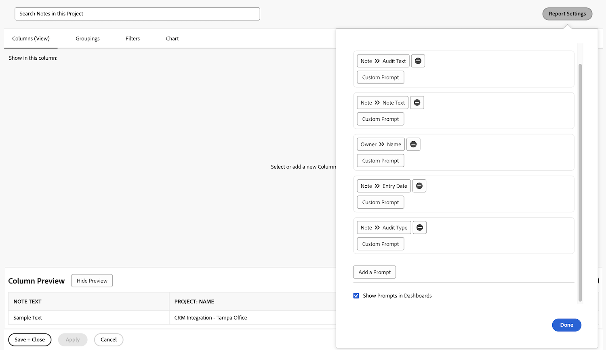
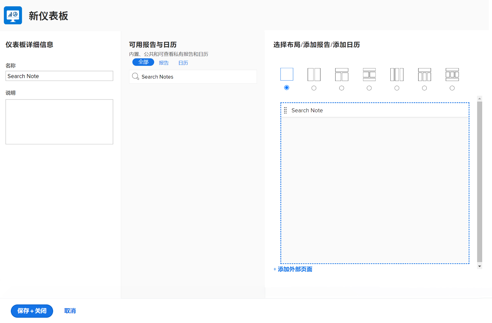
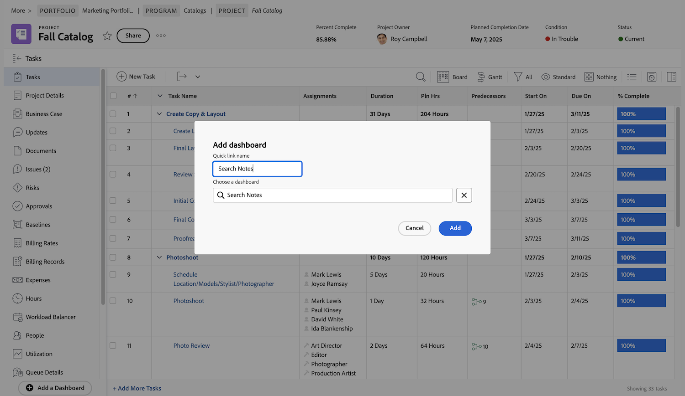
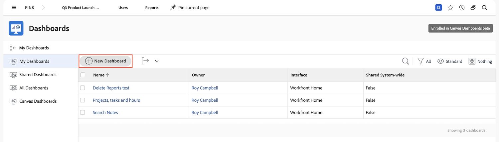

# 在Workfront中创建仪表板

此视频提供了全面指南，让您了解并使用Workfront中的功能板。
它&#x200B;说明了功能板是报表的集合，允许用户在一个位置组织和显示相关数据。

>[!VIDEO](https://video.tv.adobe.com/v/335157/?quality=12&learn=on&enablevpops=0)

## 要点

* **Workfront中的仪表板：**&#x200B;仪表板是报表的集合，允许用户在一个集中式视图中组织和显示相关数据，如项目、任务和问题。&#x200B;AEM
* **创建仪表板：**&#x200B;可以通过选择布局、添加报告、自定义日历或外部页面以及排列它们以获得最佳显示来自定义仪表板。用户还&#x200B;可以自定义哪些列显示在功能板的并排报表中。&#x200B;AEM
* **访问仪表板：**&#x200B;可以在仪表板区域的“我的仪表板”、“共享仪表板”或“所有仪表板”下找到仪表板。可以将常&#x200B;用功能板固定或添加到收藏夹以进行快速访问。&#x200B;AEM
* **共享功能板：**&#x200B;可以通过“功能板操作”菜单与其他Workfront用户共享功能板，包括功能板内的所有报表。&#x200B;AEM
* **打印功能板：**&#x200B;可直接从“功能板操作”菜单打印功能板，以便轻松共享数据的物理副本。&#x200B;AEM

## “创建仪表板”活动

### 活动 1：创建一个仪表板

创建一个只有一个报告的 [!UICONTROL dashboard]——“搜索该项目中的注释。” 这对于快速查找项目上的任何更新非常有用，即使有数千条更新内容需要搜索也是如此。 这将会搜索更新跟帖内容，以快速提取能够满足您在提示中指定的条件的任何更新。

通过复制您在“创建注释报告”活动中创建的“搜索注释”报告来创建此报告。 尚未创建它？ 单击此处可在[创建任务报告](https://experienceleague.adobe.com/en/docs/workfront-learn/tutorials-workfront/reporting/basic-reporting/create-a-task-report#activity-1-create-a-note-report-with-prompts)教程中查看活动。

* 从副本中删除“项目名称”提示，并将报告重命名为“搜索该报告中的注释”。
* 将 [!UICONTROL Dashboard] 命名为“搜索注释。”
* 转到任何项目登陆页面，并为 [!UICONTROL dashboard] 创建一个自定义部分。
* 请注意，当您在自定义部分中搜索注释时，它只会显示您当前所在项目中包含的注释。

### 答案 1

1. 运行您在“创建注释报告”活动中创建的报告。 尚未创建它？ 单击此处可在[创建任务报告](https://experienceleague.adobe.com/en/docs/workfront-learn/tutorials-workfront/reporting/basic-reporting/create-a-task-report#activity-1-create-a-note-report-with-prompts)教程中查看活动。
1. 单击 **[!UICONTROL Report Actions]** 并选择 **[!UICONTROL Copy]**。 [!DNL Workfront] 会创建一个名为“注释搜索（副本）”的新报告。
1. 前往 **[!UICONTROL Report Actions]** 并选择 **[!UICONTROL Edit]**。 单击 **[!UICONTROL Report Settings]** 并将名称更改为“搜索该项目中的注释。”
1. 单击 [!UICONTROL Report Prompts] 并从列表中删除 [!UICONTROL Project] > [!UICONTROL Name] 提示。

   

1. 选中 **[!UICONTROL Show Prompts in Dashboard]** 框。
1. 单击 **[!UICONTROL Done]**，然后单击 **[!UICONTROL Save + Close]**。 您现在会看到报告的 [!UICONTROL Prompts] 屏幕。

   接下来，您要使用快捷方式创建一个新仪表板，并向其中添加该报告。

1. 单击 **[!UICONTROL Report Actions]** 并选择 **[!UICONTROL Add to Classic Dashboard]** > **[!UICONTROL New Dashboard]**。
1. 将报告“在该项目中搜索”拖至 **[!UICONTROL Layout]** 面板。
1. 请注意，报告的名称将会成为仪表板的名称。 将名称编辑为“搜索注释”。

   

1. 单击 **[!UICONTROL Save + Close]**。

   现在将仪表板添加到项目页面。

   

1. 转到任何项目。 从左侧面板菜单中，单击&#x200B;**[!UICONTROL Add a Dashboard]**&#x200B;按钮。
1. 在 **[!UICONTROL Choose a dashboard]** 字段中，输入“搜索注释”，并从列表中选择 [!UICONTROL dashboard]。
1. 在 **[!UICONTROL Quick link name]** 字段中，输入“搜索注释”。
1. 单击 **[!UICONTROL Add]**。
1. 从左侧面板菜单中，找到底部附近的搜索注释。 单击名称左侧的圆点，并将其向上拖动到“更新”的正下方。

### 活动2：我的团队的未完成任务

创建具有3个“打开的任务”报告的[!UICONTROL dashboard]，每个报告均由分配给任务的不同团队过滤。

使用现有的“打开任务”报告（按团队筛选）（如果有），或为此仪表板创建一个新报告。 为另外两个团队复制并编辑报告两次，然后将它们放在名为&#x200B;**“我的团队的未完成任务”**&#x200B;的单个仪表板上。

### 答案 2

#### 第1部分 — 创建按您的某个团队过滤的“未结任务”报告

1. 从 **[!UICONTROL Main Menu]** 中选择 **[!UICONTROL Reports]**。
1. 单击 **[!UICONTROL New Report]** 菜单并选择 **[!UICONTROL Task]**。
1. 将您的报表命名为“分配给Creative团队的未结任务”（或您的任何其他团队）。
1. 在 **[!UICONTROL Columns (View)]** 中，将您的列设置为包括：

   

   * [!UICONTROL Project] > [!UICONTROL Name]
   * [!UICONTROL Task] > [!UICONTROL Name]
   * [!UICONTROL Task] > [!UICONTROL Assignments]
   * [!UICONTROL Task] > [!UICONTROL Duration]
   * [!UICONTROL Task] > [!UICONTROL Planned Hours]
   * [!UICONTROL Task] > [!UICONTROL Planned Start Date]
   * [!UICONTROL Task] > [!UICONTROL Planned Completion Date]
   * [!UICONTROL Task] > [!UICONTROL Percent Complete]

1. 选择&#x200B;**[!UICONTROL Planned Completion Date]**&#x200B;列并将排序更改为&#x200B;**升序**。

1. 在&#x200B;**[!UICONTROL Filters]**&#x200B;选项卡中，添加要包含的过滤器规则：

   

   * [!UICONTROL Project] > [!UICONTROL Status Equates With] > [!UICONTROL Equal] > “当前”
   * [!UICONTROL Task] > [!UICONTROL Team ID] > [!UICONTROL Equal] > &quot;Creative&quot;
   * [!UICONTROL Task] > [!UICONTROL Percent Complete]  > [!UICONTROL Less Than] > &quot;100&quot;

1. 单击&#x200B;**[!UICONTROL Save+Close]**&#x200B;按钮保存并关闭报告。

#### 第2部分 — 复制您刚刚创建的报告并为第二个团队创建新报告

1. 查看您刚刚创建的报告，单击&#x200B;**[!UICONTROL Report Actions]>[!UICONTROL Copy]**。
1. 新报告将在标题中追加名称&#x200B;**&quot;（副本）&quot;**。
1. 单击&#x200B;**[!UICONTROL Report Actions]>[!UICONTROL Edit]**。 然后，更改过滤器和报表标题以关注Orion团队（或您的任何其他团队）。
1. 单击[!UICONTROL Filters]选项卡，然后更改筛选规则
   **[!UICONTROL Task]> [!UICONTROL Team ID] > [!UICONTROL Equal] > &quot;Creative&quot;**&#x200B;至
   **[!UICONTROL Task]> [!UICONTROL Team ID] > [!UICONTROL Equal] > “猎户座”**
1. 在“报告标题”字段中，将&#x200B;**[!UICONTROL "Creative"]**&#x200B;一词更改为&#x200B;**[!UICONTROL "Orion"]**&#x200B;并删除&#x200B;**“（复制）”**&#x200B;单词。
1. 单击&#x200B;**[!UICONTROL Save+Close]**&#x200B;按钮保存并关闭报告。

#### 第3部分 — 再次复制报告并为您的第三个团队创建新报告

1. 查看您刚刚创建的报告，再次单击&#x200B;**[!UICONTROL Report Actions]>[!UICONTROL Copy]**。 这次，将标题和过滤器中的团队名称更改为“Digital Marketing”（或您的任何其他团队）。

#### 第4部分 — 创建一个显示每个团队的未完成任务的功能板

1. 从主菜单中，单击&#x200B;**[!UICONTROL Dashboards]**。
1. 然后单击 **[!UICONTROL New Dashboard]**。

   

1. 将仪表板命名为&#x200B;**“我的团队的未完成任务”**。
1. 在&#x200B;**[!UICONTROL Search by name]**&#x200B;字段中开始键入报表的名称。
1. 由于报表名称的开头都是相同的单词，因此您可能会看到它们都类似下面这样：

   

1. 将它们分别拖到布局区域中，然后单击“保存+关闭”。

   

1. 下面是最后一个仪表板：

   
