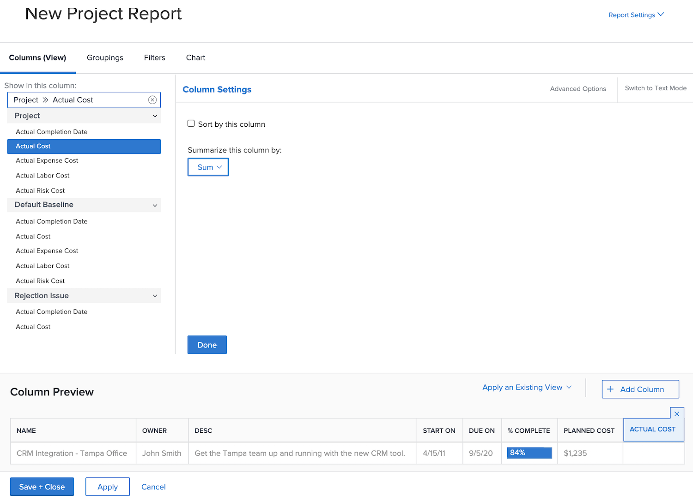
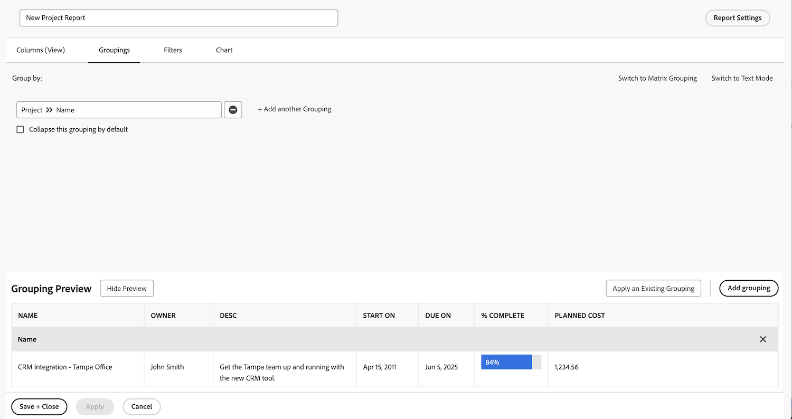
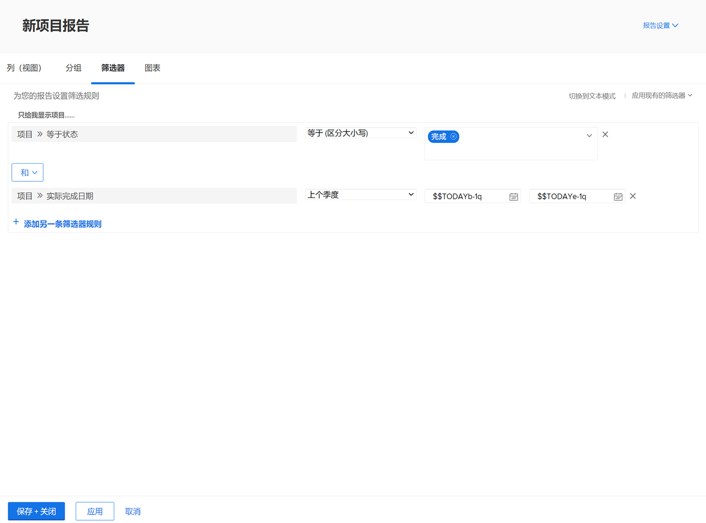
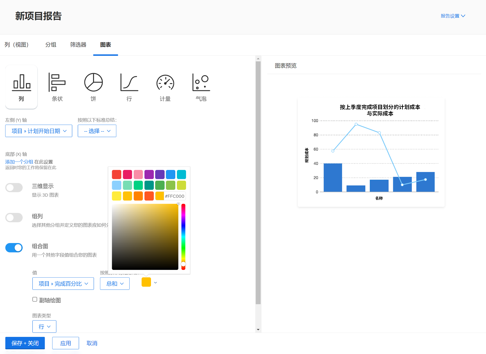

# 使用报表中的图表可视化数据

此视频介绍如何使用图表有效地可视化数据，特别是用于跟踪项目任务。 它示&#x200B;范了如何在Workfront中创建两种类型的报表：

**按项目列出的延迟任务报告：**

* 从列表报告开始，并应用过滤器以仅显示当前项目中的未完成、延迟的任务。  
* 按项目名称对任务进行分组并创建饼图，以可视化项目间延迟任务的分布情况。  
* 将图表设置为默认选项卡以方便访问。  

**按项目和进度状态列出的任务报告：**

* 复制第一个报告，并为任务进度状态添加另一个分组。
* 删除筛选器以包含所有任务，并在项目执行期间显示其进度。
* 使用栈叠柱状图显示每个项目的任务总数，栈叠表示不同的进度状态。
* 根据需要自定义颜色并保存报表。

此视频重点介绍饼图和栈叠柱状图等图表如何提供任务分布和项目性能的见解，帮助用户比较项目并以可视方式了解任务进度。  

>[!VIDEO](https://video.tv.adobe.com/v/335155/?quality=12&learn=on&enablevpops=0)

## 关键要点

* **图表增强数据清晰度**：使用图表（如饼图或柱状图）可视化数据，与列表报告相比，更容易了解任务分布和项目进度。  
* **筛选特定见解**：应用筛选器（例如，当前项目中的未完成、延迟的任务）有助于将重点放在相关数据上进行目标分析。  
* **为更好的组织分组**：按项目名称或进度状态分组任务可以有效地组织数据，从而能够跨项目进行有意义的比较。  
* **图表自定义选项**：用户可以选择图表类型（例如，饼图、列、条形图）并自定义颜色以与首选项或品牌保持一致。  
* **用于详细分析的栈叠柱状图**：栈叠柱状图提供项目内任务进度的全面视图，在单个可视化中显示总任务及其状态。

## “创建带有图表的报告”活动

### 活动 1：将图表添加到报告中

本季度即将结束，您想看看最近完成的项目是否符合预算。 创建一份报告，其中显示项目的规划成本与实际成本。 您只想查看上一季度完成的项目。 使用自定义颜色添加组合柱形图。

### 答案 1

1. 从 **[!UICONTROL Main Menu]** 中选择 **[!UICONTROL Reports]**。
1. 单击 **[!UICONTROL New Report]** 菜单并选择 **[!UICONTROL Project]**。
1. 在 **[!UICONTROL Columns (View)]** 选项卡中，单击 **[!UICONTROL Add Column]**。
1. 选择 [!UICONTROL Project] > [!UICONTROL Planned Cost]，并按 **[!UICONTROL Sum]** 对本列进行汇总。
1. 再次单击 **[!UICONTROL Add Column]**。
1. 选择 [!UICONTROL Project] > [!UICONTROL Actual Cost]，并按 **[!UICONTROL Sum]** 对本列进行汇总。

   

1. 在 **[!UICONTROL Groupings]** 选项卡中，将报告设置为根据 [!UICONTROL Project] > [!UICONTROL Name] 分组。

   

1. 在 **[!UICONTROL Filters]** 选项卡中，添加两条过滤规则：

   * [!UICONTROL Project] > [!UICONTROL Status Equates With] > [!UICONTROL Complete]
   * [!UICONTROL Project] >[!UICONTROL  Actual Completion Date] > [!UICONTROL Last Quarter]

   

1. 在 **[!UICONTROL Chart]** 选项卡中，为图表类型选择 **[!UICONTROL Column]**。
1. 对于[!UICONTROL Left (Y) Axis]，请选择[!UICONTROL Planned Cost]。
1. 对于[!UICONTROL Bottom (X) Axis]，请选择[!UICONTROL Name]。
1. 单击&#x200B;**[!UICONTROL Combination Chart]**&#x200B;按钮并在&#x200B;**[!UICONTROL Value]**&#x200B;字段中选择[!UICONTROL Actual Cost]。
1. 在&#x200B;**[!UICONTROL Chart Type]**&#x200B;字段中，选择“行”。
1. 单击颜色框以更改[!UICONTROL Actual Cost]颜色。 选择颜色。
1. 单击 **[!UICONTROL Save + Close]**。 当系统提示输入报告名称时，将其命名为“上季度完成项目的规划成本与实际成本”。

   
