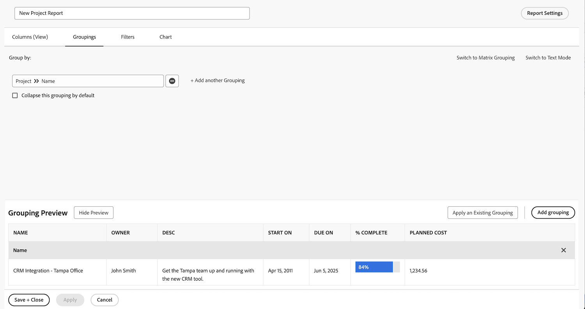

# 使用图表创建报告

在此视频中，您将学习：

* 图表如何改进数据的可视化
* 如何使用Workfront的图表工具

>[!VIDEO](https://video.tv.adobe.com/v/335155/?quality=12)

## 活动：将图表添加到报表

季度末即将到来，您希望了解最近完成的项目是如何坚持到预算水平的。 创建一个报表，以显示项目的计划成本与实际成本。 您只想查看在上个季度完成的项目。 使用自定义颜色添加组合列图。

## 回答

1. 选择 **[!UICONTROL Reports]** 从 **[!UICONTROL Main Menu]**.
1. 单击 **[!UICONTROL New Report]** 菜单和选择 **[!UICONTROL Project]**.
1. 在 **[!UICONTROL Columns (View)]** ，单击 **[!UICONTROL Add Column]**.
1. 选择 [!UICONTROL Project] > [!UICONTROL Planned Cost] 并以下面的方式总结 **[!UICONTROL Sum]**.
1. 单击 **[!UICONTROL Add Column]** 再次。
1. 选择 [!UICONTROL Project] > [!UICONTROL Actual Cost] 并以下面的方式总结 **[!UICONTROL Sum]**.

   

1. 在 **[!UICONTROL Groupings]** 选项卡，将报表设置为按 [!UICONTROL Project] > [!UICONTROL Name].

   

1. 在 **[!UICONTROL Filters]** 选项卡，添加两个过滤器规则：

   * [!UICONTROL Project] > [!UICONTROL Status Equates With] > [!UICONTROL Complete]
   * [!UICONTROL Project] >[!UICONTROL  Actual Completion Date] > [!UICONTROL Last Quarter]

   

1. 在 **[!UICONTROL Chart]** 选项卡，选择 **[!UICONTROL Column]** ，例如图表类型。
1. 对于 [!UICONTROL Left (Y) Axis]，选择 [!UICONTROL Project] > [!UICONTROL Planned Cost].
1. 对于 [!UICONTROL Bottom (X) Axis]，选择 [!UICONTROL Project] > [!UICONTROL Name].
1. 单击 **[!UICONTROL Combination Chart]** 按钮，选择 [!UICONTROL Project] > [!UICONTROL Actual Cost] 在 **[!UICONTROL Value]** 字段。
1. 单击颜色框旁边的箭头可更改 [!UICONTROL Actual Cost] 颜色。 选择显示的颜色之一，或单击右下角的框以调出调色板。
1. 单击 **[!UICONTROL Save + Close]**. 在提示输入报表名称时，请将其命名为“按项目上个季度完成的计划成本与实际成本”。

   
