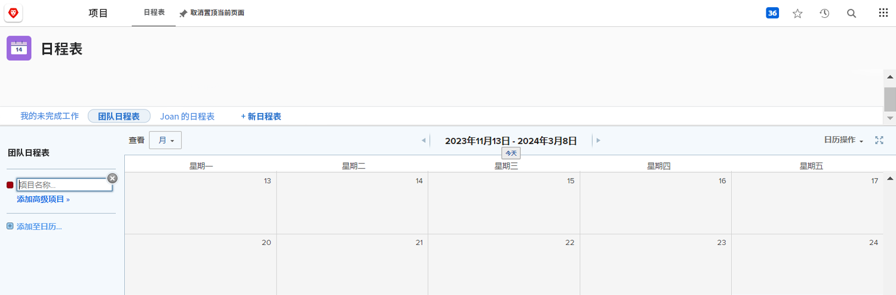
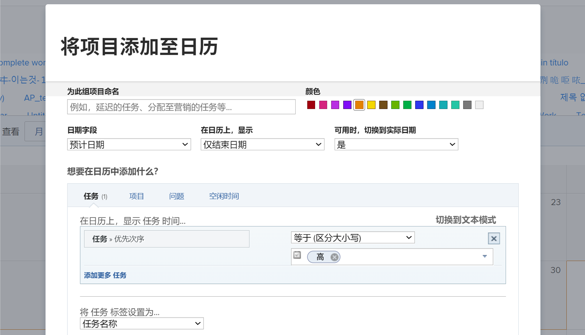
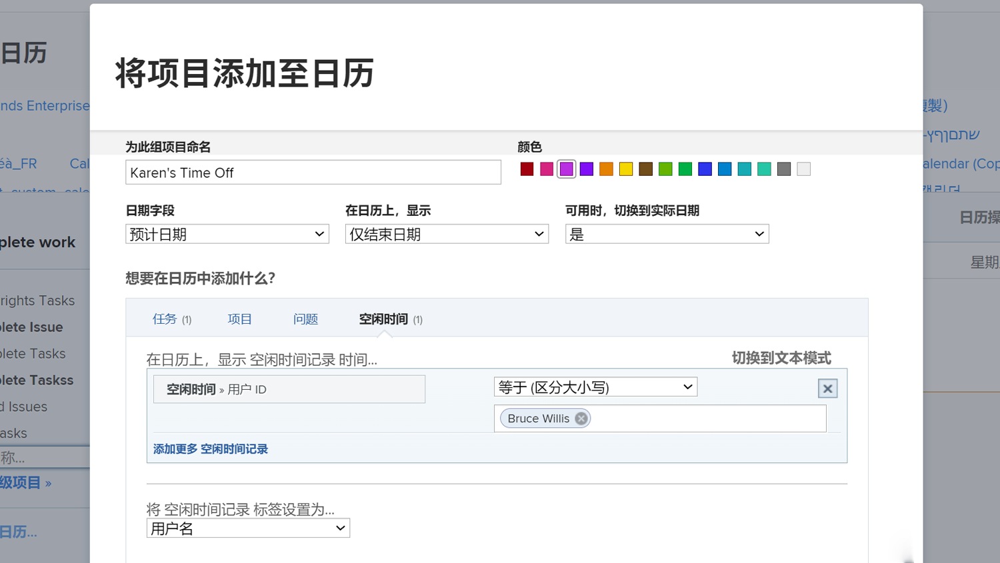

# 创建自定义日历

在此部分中，您将学习如何：

* 创建新日历
* 创建日历分组
* 将工作项添加到日历分组
* 创建日历时间

以下是如何创建自己的自定义日历。

## 首先，添加新日历

1. 从 **[!UICONTROL Main Menu]**，选择 **[!UICONTROL Calendars]** 的上界。
1. 单击 **[!UICONTROL New Calendar]** 选项。
1. 键入日历的名称并按 **[!UICONTROL Return]**.

## 其次，添加日历分组

1. 要显示与特定项目相关的项目，请在 [!UICONTROL grouping] 字段（此选项将显示与该项目相关的所有任务）。
1. 或者，单击 **[!UICONTROL Add advanced items]** 选项，以包含系统中各种项目中的工作项。

## 第三，将工作项添加到日历分组

1. 命名分组以反映将显示的内容。
1. 为组选择颜色指定。
1. 选择要使用的日期类型 — [!UICONTROL Projected dates], [!UICONTROL Planned dates]或 [!UICONTROL Custom]. ([!UICONTROL Custom] 日期是包含在 [!UICONTROL custom forms].)
1. 选择要在日历上显示的日期 — [!UICONTROL End Date Only], [!UICONTROL Start Date Only]或 [!UICONTROL Duration (Start to End)].
1. 如果您想要显示 [!UICONTROL Actual dates] 当该信息可用时，从菜单中选择“是”。 如果您始终希望选择的日期类型([!UICONTROL Projected], [!UICONTROL Planned]或 [!UICONTROL Custom])来显示。
1. 选择要在日历上查看的项目信息类型 — [!UICONTROL Tasks], [!UICONTROL Projects], [!UICONTROL Issues]或 [!UICONTROL Time Off].
1. 设置过滤器以显示所需的信息。
1. 单击 **[!UICONTROL Save]**.

>[!NOTE]
>
>使用添加到日历选项，可以将其他分组添加到现有日历。

## 创建显示个人休假时间的日历

[!DNL Workfront] 提供了一种在用户配置文件中使用个人休假功能指定休假时间的方法。 这会提醒项目经理您不可用，并允许计划的完成日期根据需要自动或手动调整。

在“日历”区域中，您可以创建显示这些登入时间的日历视图。

为特定人员创建日历：

1. 单击 **[!UICONTROL Add to Calendar]** 中。
1. 单击 **[!UICONTROL Add advanced items]**.
1. 命名分组以反映将显示的内容。
1. 为分组选择颜色指定。
1. 设置 [!UICONTROL Date Field] to [!UICONTROL Planned dates].
1. 选择要在日历上显示的日期 — [!UICONTROL Duration].
1. 如果实际日期不可用，则忽略信息的显示方式。 这不适用。
1. 选择 [!UICONTROL Time Off] ，以了解要查看的信息类型。
1. 对于过滤器，将用户ID设置为团队成员的名称。
1. 单击 **[!UICONTROL Save]**.

