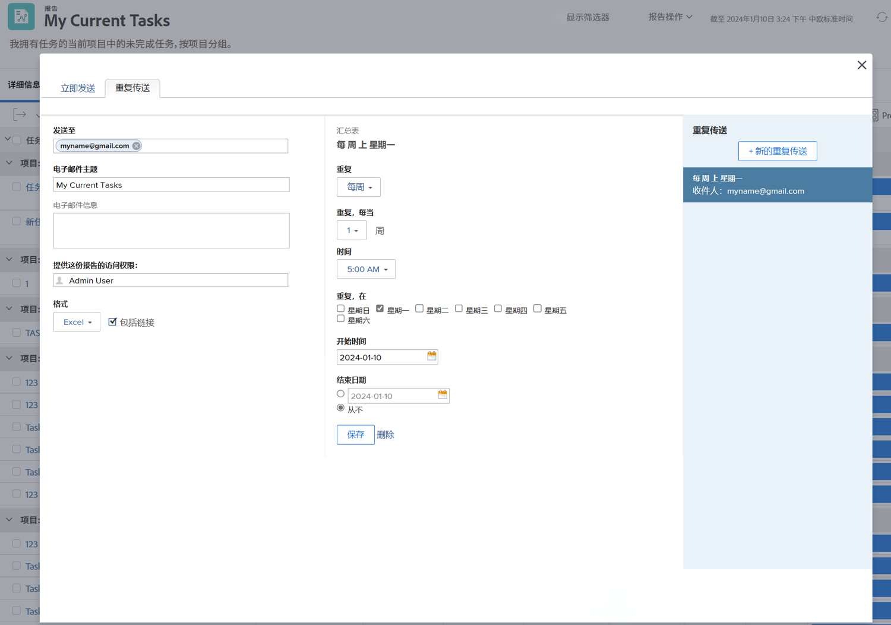

# 发送和共享报表

在此视频中，您将学习：

* 如何向用户、团队或任何电子邮件地址发送报表
* 如何与任何人共享报表
* 收件人可以查看和处理Workfront报表的内容

>[!VIDEO](https://video.tv.adobe.com/v/335158/?quality=12&learn=on)

## 活动：发送报表

每周一早上5点以Excel电子表格形式向您自己发送报表。 这是自动收集每周报表的绝佳方法，您以后可以使用这些报表查看趋势。

## 回答

1. 查看您创建的任何报表，然后选择 **[!UICONTROL Send Report]** 从 **[!UICONTROL Report Actions]** 菜单。
1. 单击 **[!UICONTROL Repeating Deliveries]** 选项卡。
1. 将您的电子邮件地址放在 **[!UICONTROL Send to]** 字段。
1. 提供电子邮件主题。
1. 将格式更改为Excel。
1. 已设置 **[!UICONTROL Repeats]** to [!UICONTROL Weekly].
1. 设置 [!UICONTROL Time] 5点。
1. 已设置 [!UICONTROL Repeats On] 到星期一。
1. 单击 **[!UICONTROL Save]**.

>[!NOTE]
>
>请注意 [!UICONTROL Repeating Deliveries] 面板。 您可以为报表设置多个投放，所有投放都会显示在此处。

**DELETE投放**

选择之前创建的投放，然后单击删除(位于 **[!UICONTROL Save]** 按钮)。
