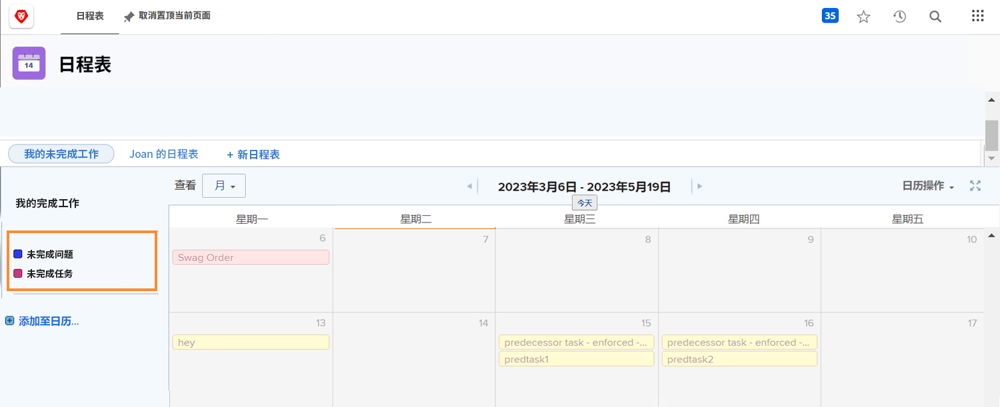
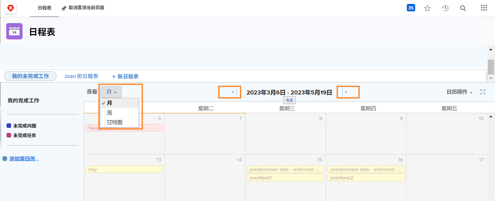
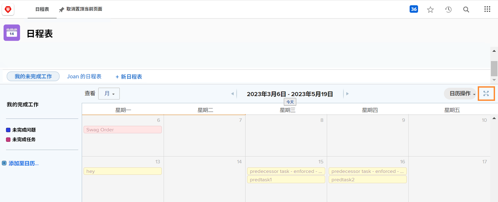
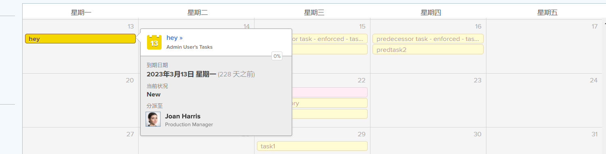
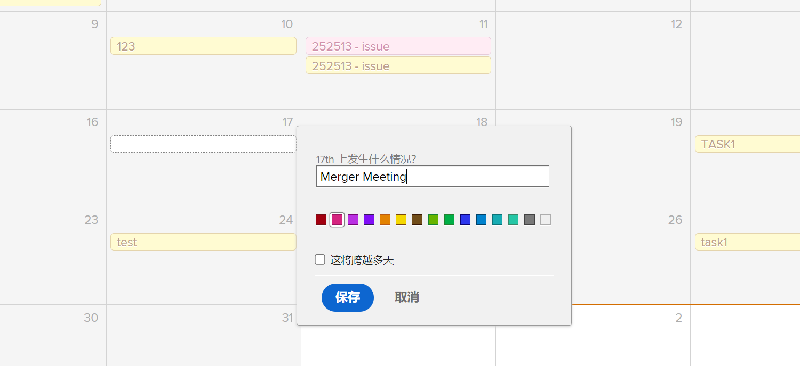

# 了解日历界面

在本节中，您将了解：

* 日历分组
* 日历查看
* 日历操作菜单
* 以及如何创建临时日历项目

在创建您自己的自定义日历之前，让我们浏览一下自定义日历上可用的基本功能。

## 日历分组

单个日历可以组织为不同的工作项分组。 每个分组都可以打开和关闭，使用户能够随时专注于最重要的工作项目。

## 日历查看

日历可以按月、周或格式显示 [!UICONTROL Gantt] 格式。 使用侧面的滚动条或顶部的箭头在日历中移动。 此 [!UICONTROL Gantt] “视图”允许您从不同的角度查看您的工作。 查找最适合您的视图。

![中日历屏幕的图像 [!UICONTROL Gantt] 视图](assets/calendar-1-1bb.png)

## [!UICONTROL Calendar Actions] 菜单

与其他工作项一样，日历也具有 [!UICONTROL Actions] 菜单，允许您查看日历中的周末；删除或复制日历；与个人Workfront用户、系统范围用户或与外部用户共享日历；以及将日历添加到您的 [!UICONTROL Favorites] 菜单。

![的图像 [!UICONTROL Calendar Actions] screen](assets/calendar-1-1c.png)

## 全屏模式

单击全屏图标以全屏模式查看日历。 再次单击可返回到原始大小。

## 摘要信息

选择日历中的项目以显示该项目的汇总详细信息，包括名称、原始项目、状态、分配、进度状态和到期日。

## 临时事件

双击以在日历上创建临时事件来表示您的计划或其他工作项。

>[!NOTE]
>
>创建临时事件不会在Workfront中创建任务。

