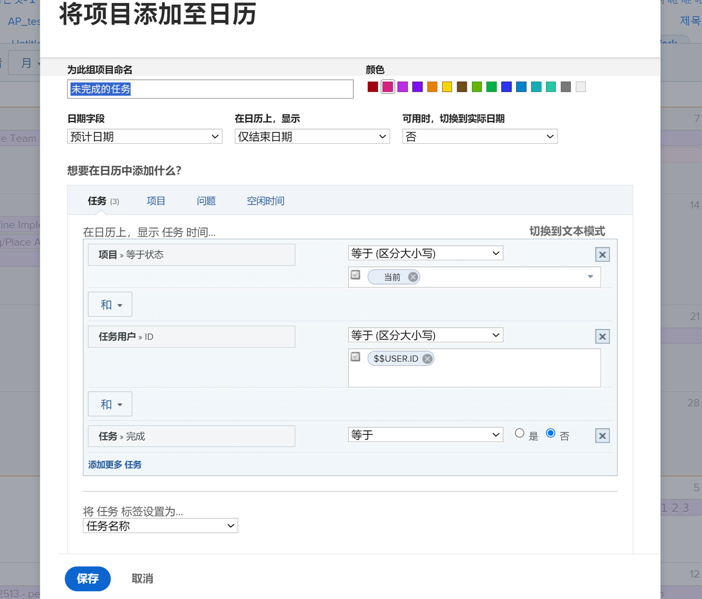
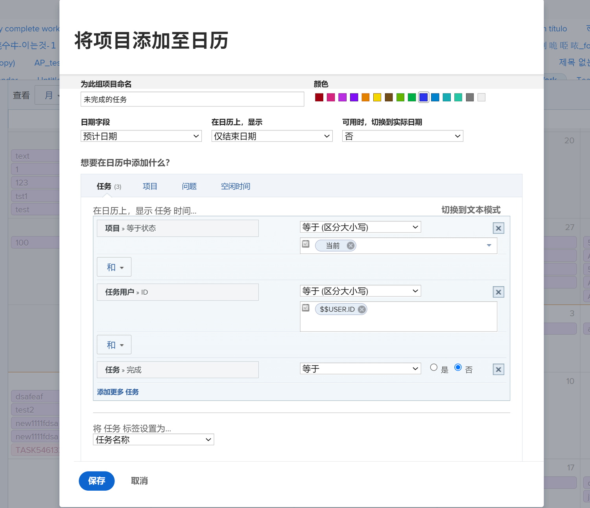
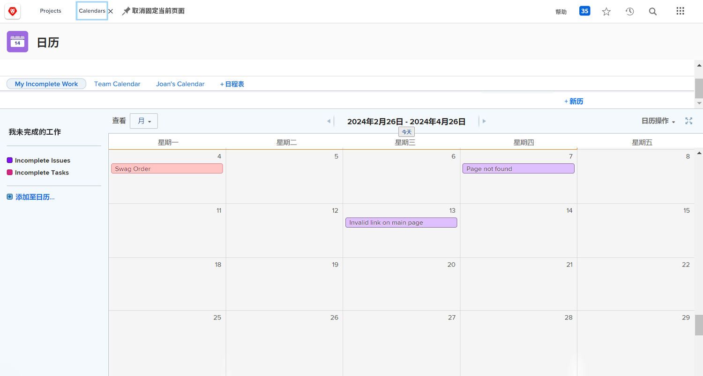

# 轮到您创建日程表报告了

在此活动中，您将获得创建自己日程表的实践体验。

## 活动：创建一个日程表

创建名为“我未完成的工作”的客户日程表。

包括名为“未完成的任务”的日程表组，其中显示“当前”项目中分配给您的所有未完成的任务。

选择红色作为这些项目的颜色。

包括另一个名为“未完成的问题”的日程表组，其中显示在“当前”项目中分配给您的所有未完成的问题。选择蓝色作为这些项目的颜色。

## 答案

1. 从主菜单导航至日程表区域。
1. 单击“新建日程表”按钮，并将该日程表命名为“我未完成的工作”。
1. 在第一个分组下，单击“添加高级项目”。
1. 在弹出的“在日程表中添加项目”窗口中，将该组命名为“未完成的任务”。
1. 选择红色作为其颜色。
1. 将“日期字段”更改为“规划日期”。
1. 将“在日程表上显示”字段设置为“仅结束日期”。
1. 将“可用时切换到实际日期”字段设置为“否”。

   

1. 在“您想要在日程表中添加什么？”部分，选择“任务”。
1. 添加三个过滤规则：

   * 项目 > 状态等于 > 等于 > 当前
   * 任务用户 > ID > 等于 > $$USER.ID
   * 任务 > 完成 > 等于 > False

1. 单击“保存”。

   

1. 单击“添加到日程表”创建第二个分组。
1. 在此分组下，单击“添加高级项目”。
1. 在弹出的“在日程表中添加项目”窗口中，将该组命名为“未完成的问题”。
1. 选择蓝色作为颜色。
1. 将“日期字段”更改为“规划日期”。
1. 将“在日程表上显示”字段设置为“仅结束日期”。
1. 将“可用时切换到实际日期”字段设置为“否”。
1. 在“您想要在日程表中添加什么？”部分，选择“问题”。
1. 添加以下三个过滤规则：

   * 项目 > 状态等于 > 等于 > 当前
   * 任务用户 > ID > 等于 > $$USER.ID
   * 问题 > 完成 > 等于 > False

1. 单击“保存”。

   

由于您在过滤器中使用了 $$USER.ID，因此您可以与其他人共享此日程表，他们会看到自己未完成的任务和问题。
