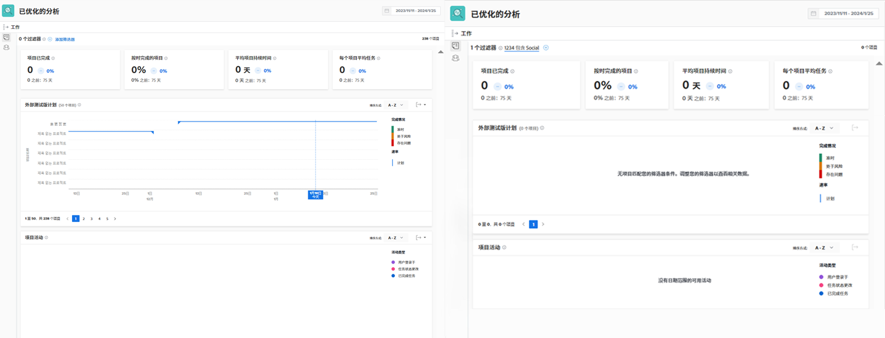

# 了解关键绩效指标

在本视频中，您将了解到：

* 如何从 KPI 数据中获取价值

>[!VIDEO](https://video.tv.adobe.com/v/335046/?quality=12&learn=on)

## 比较 KPI

KPI 不仅为当前发生的事情提供有价值的信息，而且使用户能够比较活动随时间的变化或项目组合、计划、项目所有者或所使用的任何其他过滤器之间的差异。

例如，您可以在两个浏览器选项卡中打开 Analytics 来比较 KPI。
