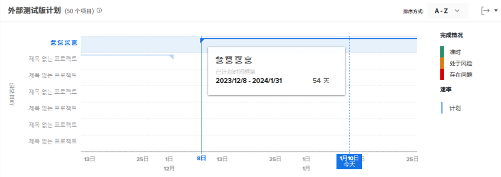
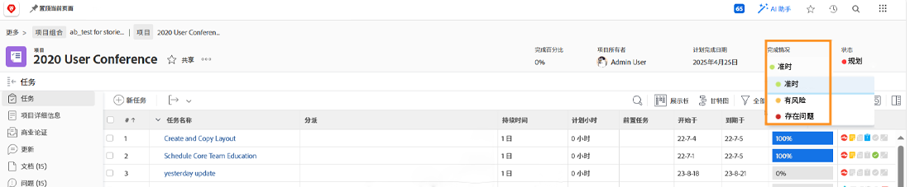
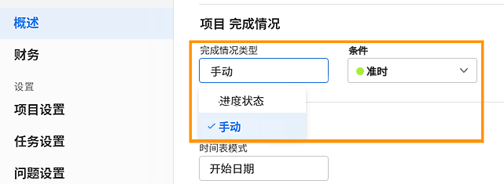

# 了解导航和审查项目

在本视频中，您将了解到：

* 如何阅读任务执行计划图表

>[!VIDEO](https://video.tv.adobe.com/v/335047/?quality=12&learn=on)

## 任务执行计划图表

在该图表上，您会看到：

1. 项目名称位于左侧。
1. 日期显示在底部。
1. 垂直的蓝线显示鼠标悬停的具体日期。
1. 水平蓝线显示项目的规划开始和结束日期。
1. 绿线表示项目达到目标。
1. 橙线表示项目处于存在风险的状态。
1. 红线表示项目出现问题。

查看有关您的项目的信息可以帮助您确定：

* 哪些事件造成您的项目超出了规划完成日期。
* 项目何时开始遇到问题。
* 同一时段内有多少个项目处于开放状态。
* 有多少项目处于活动状态。
* 哪些项目需要额外的关注或支持。

## 完成情况基于进度状态

项目完成情况是项目进展情况的直观呈现。Workfront 根据项目内任务的进度状态确定完成情况。

项目完成情况的设置如下：

* **手动**，当项目的完成情况类型设置为手动时，由有权管理项目的用户执行。这使您可以独立于关键路径设置项目的完成情况。
* **自动**，当项目的完成情况类型设置为“进度状态”时，Workfront 会自动执行。

Workfront 建议您将完成情况类型设置为“进度状态”，以便您根据任务的进度清楚地了解项目的真实进度。

当设置为“进度状态”时，项目完成情况可以是：

* **达到目标**——当关键路径上最后一个任务的进度状态为“按时”时，项目的完成情况将为“达到目标”。该项目有望如期完成。
* **存在风险**——当关键路径上最后一个任务的进度状态为“落后”或“存在风险”时，则项目的完成情况为“存在风险”。该项目预计会延迟完成，但目前还没有延迟。
* **出现问题**——当关键路径上最后一个任务的进度状态为“延迟”时，则项目的完成情况为“出现问题”。截止日期已过，项目现已延迟。

>[!NOTE]
>
>完成情况可以根据您的环境进行自定义，因此您可能会看到超过三个选项，或者其名称可能与上述不同。有关自定义条件的信息，请参阅[创建或编辑自定义完成情况](https://experienceleague.adobe.com/docs/workfront/using/administration-and-setup/customize/custom-conditions/create-edit-custom-conditions.html?lang=zh-Hans)一文。
