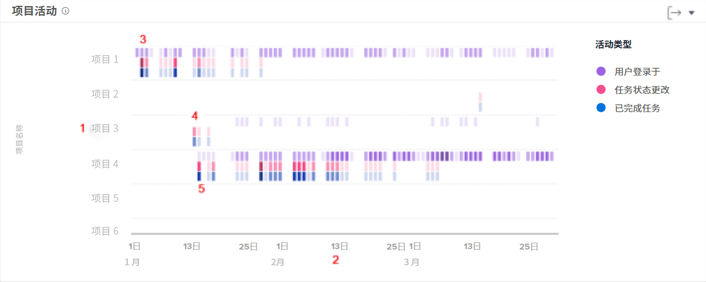

# 了解导航和审阅项目活动

在本视频中，您将了解到：

* 如何根据登录用户、任务状态更改和已完成任务来比较项目

>[!VIDEO](https://video.tv.adobe.com/v/3437446/?quality=12&learn=on&enablevpops=1&captions=chi_hans)

## 比较项目工作

项目活动图表有助于您了解项目活动（登录的用户、任务状态更改和已完成的任务）并将其与 Workfront 中的其他项目进行比较。项目活动以不同颜色显示，以总结一段时间内的活动。

查看此信息可以帮助您确定：

* 针对特定项目的活动。
* 与其他项目相比，一个项目的活动情况。
* 哪些用户正在处理一个项目，频率是多少。

在图表上，您可以看到：

1. 项目名称在左侧。
1. 日期显示在底部。
1. 紫色框显示分配给该项目的用户当天登录了系统，深色阴影表示登录的用户数量较多。
1. 粉色框显示用户在当天更改了项目任务的状态，其中较深的阴影表示更改的任务状态数量较多。
1. 蓝色框表示用户完成了项目中的一个任务，其中深色框表示完成的任务数量较多。
