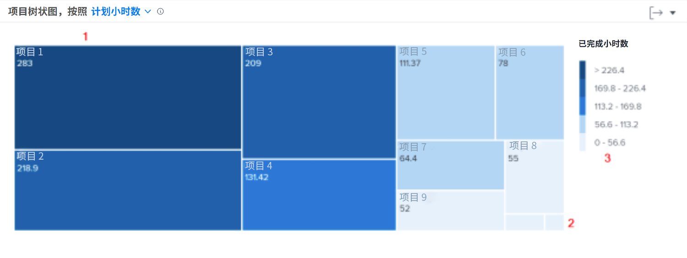

# 深入挖掘导航

在此视频中，您将学习：

* 如何快速了解员工在每个项目中投入的时间

>[!VIDEO](https://video.tv.adobe.com/v/335050/?quality=12)

## 审查项目逗留时间

利用项目树图，可了解用户为项目投入了多少时间。 框表示项目。 该框的大小显示与其他项目相比，在项目上花费的时间。 盒子越大，所花费的时间就越多。

查看此信息可帮助您确定：

* 在选定日期范围内处理的项目的优先级。
* 用户花时间的内容。
* 如果用户关注正确的事情。
* 选择特定项目后，该时间段内项目的范围发生了多大更改。

在图表上，您可以看到：

1. 在过滤时间内完成的项目会用较大的框和深蓝色表示。
1. 在过滤时间内完成的项目会用较小的框和浅蓝色表示。
1. 图表右侧的图例显示了每个蓝色阴影的已完成小时数范围。
