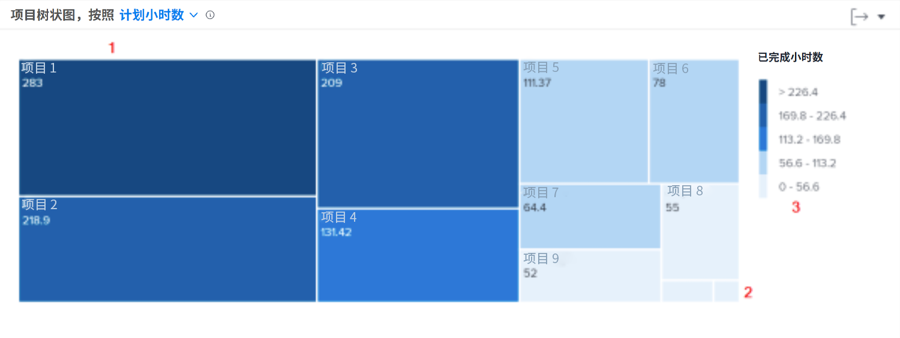

# 深入了解导航

在本视频中，您将了解到：

* 如何快速查看员工在每个项目上投入了多少时间

>[!VIDEO](https://video.tv.adobe.com/v/335050/?quality=12&learn=on&enablevpops=1)

## 审阅项目所花费的时间

项目树形图有助于您了解用户在某个项目上投入了多少时间。 方框代表项目。 方框的大小显示了与其他项目相比，该项目花费了多少时间。 方框越大，花费的时间就越多。

查看此信息可以帮助您确定：

* 在选定的日期范围内所处理的事项的优先级。
* 用户将时间花在哪些事项上。
* 用户是否专注于正确的事项。
* 当选择特定项目时，项目范围在该时段内发生了多大的变化。

在图表上，您可以看到：

1. 在过滤的时间内完成的小时数较多的项目由较大的框和深蓝色表示。
1. 在过滤的时间内完成的小时数较少的项目由较小的框和浅蓝色表示。
1. 图表右侧的图例显示了每种蓝色阴影的完成小时数范围。
