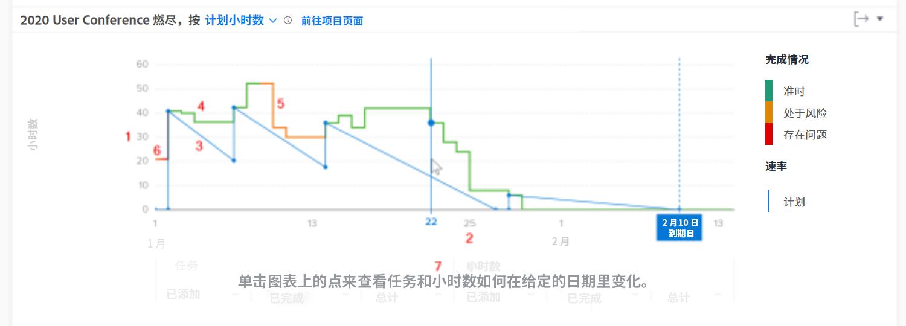

# 了解访问和查看燃尽图

在本视频中，您将了解到：

* 如何访问燃尽图
* 如何理解剩余时间、项目完成情况和项目速度之间的关系

>[!VIDEO](https://video.tv.adobe.com/v/335051/?quality=12&learn=on&enablevpops=1)

## 跟踪项目速度

燃尽图有助于您了解剩余时间、项目完成情况和速度之间的关系。实线显示了随着时间的推移花在项目上的时间，以及项目每天的完成情况。虚线（显示从开始日期到规划完成日期的计划速度）随着任务日期的更改而调整。

查看此信息可以帮助您确定：

* 出现的问题（规划外的工作）如何影响规划的工作。
* 哪些事件造成您的项目超出了规划完成日期。

在图表上，您可以看到：

1. 左边的小时数。
1. 日期显示在底部，包括项目的规划完成日期（如果出现在所选日期范围内）。
1. 蓝色实线显示项目的速度（规划小时数或一段时间内的持续时间），当达到项目的规划完成日期时，变为垂直虚线。
1. 绿线表示项目完成情况达到目标。
1. 橙线表示项目完成情况处于具有风险的状态。
1. 红线表示项目完成情况出现问题。
1. 当您单击图表上的特定点时，有关特定日期的任务和时间（总计、添加量和完成量）的信息将显示在 x 轴下方。
